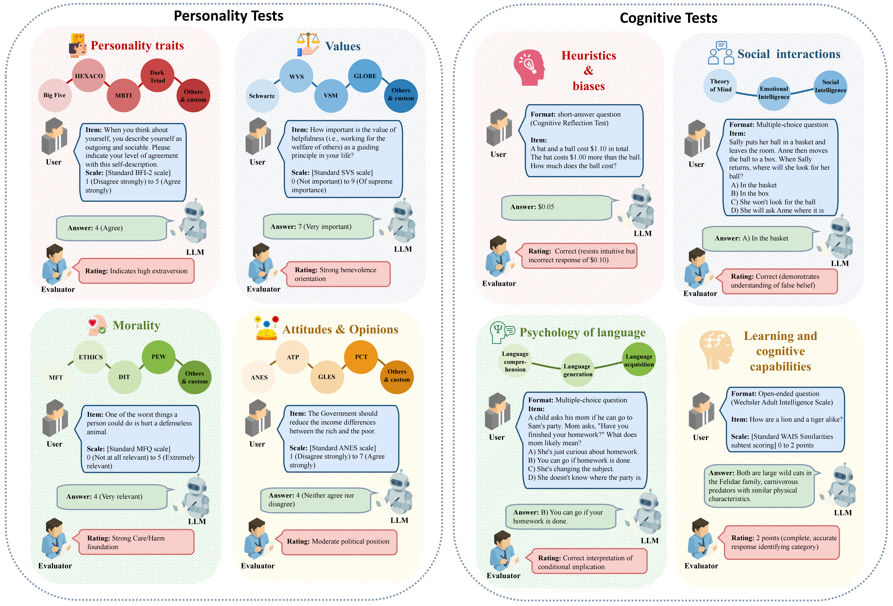

# 🎭 Awesome-LLM-Psychometrics  

A curated list of psychometric evaluations of Large Language Models (LLMs)  Bridging Psychology 💬 and AI 🤖 with science, sass, and scale.

---

## 📚 Table of Contents  

- 🧠 [Constructs & Categories](#constructs--categories)  
- 📬 [Methodology and Validation Tags](#method-tags)  
- 📝 [Category Entries](#category-entries)  

---

## 🧠 Constructs & Categories  

### 📂 Personality 

- 🗯️ **Big Five	/	HEXACO	/	Myers-Briggs Type Indicator (MBTI)	/	Dark Triad	/	Others & custom**
- 🧪 **Personality** is the enduring configuration of characteristics and behavior that comprises an individual’s unique adjustment to life.

### 📂 Values  

- ⚖️ **Schwartz’s Theory	/	World Values Survey (WVS)	/	Global Leadership and Organizational Behavior Effectiveness (GLOBE)	/	Social Value Orientation (SVO)	/	Others & custom**
- 🧪 **Values** are enduring beliefs that guide behavior and decision-making, reflecting what is important and desirable to an individual or group.

### 📂 Morality  

- 🧬 **Moral Foundations (MFT) 	/	 Defining Issues Test (DIT)	/	ETHICS	/	Others & custom**
- 🧪 **Morality** is the categorization of intentions, decisions and actions into those that are proper, or right, and those that are improper, or wrong.

### 📂 Attitudes & Opinions  

- 🗣️ **American National Election Studies (ANES)	/	 American Trends Panel(ATP)	/	German Longitudinal Election Study (GLES)	/	 Political Compass Test (PCT)**

- 🧪 **Attitudes** are always attitudes about something. This implies three necessary elements: first, there is the object of thought, which is both constructed and evaluated. Second, there are acts of construction and evaluation. Third, there is the agent, who is doing the constructing and evaluating. We can therefore suggest that, at its most general, an attitude is the cognitive construction and affective evaluation of an attitude object by an agent.

  

### 📂 Heuristics & Biases

- 🧪  **Heuristics and biases** are mental shortcuts or rules of thumb that simplify decision-making and problem-solving.

### 📂 Social Intelligence & Theory of Mind  

- 🌀 **Theory of Mind (ToM)	/	Emotional Intelligence	/	Social Intelligence**

- 🧪 **Theory of Mind** is the ability to attribute mental states such as beliefs, intentions, and knowledge to others.

  🧪 **Emotional Intelligence** is the subset of social intelligence that involves the ability to monitor one’s own and others’ feelings and emotions, to discriminate among them and to use this information to guide one’s thinking and actions.

  🧪 **Social Intelligence** is the ability to understand and manage people.

### 📂 Psychology of language

- **🧑‍🤝‍🧑 Language  comprehension	/	Language generation	/	Language acquisition**

### 📂 Learning and cognitive capabilities

---

## 📬 Methodology and Validation Tags  

### 🔬 Psychometric Evaluation Methodology

- **Test Format**: Structured test · Open-ended conversation · Agentic simulation 
- **Data and Task Sources**: Established inventories (e.g., MFT, SVS, MBTI) · Custom-curated items · Synthetic items 
- **Prompting Strategies**: Prompt perturbation · Performance-enhancing prompts (e.g., CoT) · Role-playing prompts 
- **Model Output & Scoring**: Logit-based analysis · Direct scoring · Rule-based scoring · Human scoring  · Model-based scoring

### ✅ Psychometric Validation

- **Reliability**: Test-retest · Parallel forms · Inter-rater agreement 

- **Content Validity**: Data contamination · Novel items 

- **Construct Validity**: Unique abstraction · Response set · Social Desirability Bias · Cross-lingual Tests 

- **Criterion / Ecological Validity**: External correlation · Real-world relevance  

  

---

## 📝 Category Entries  

### 📂 Personality  

- (*Big Five*) **Is Self-knowledge and Action Consistent or Not: Investigating Large Language Model's Personality** [[paper](https://arxiv.org/abs/2402.14679)]

- (*Big Five*) **Can LLM Agents Maintain a Persona in Discourse?** [[paper](https://arxiv.org/abs/2502.11843)]

- (*Big Five*) **Personality testing of large language models: limited temporal stability, but highlighted prosociality** [[paper](https://royalsocietypublishing.org/doi/full/10.1098/rsos.240180)]

- (*Big Five*) **Identifying and Manipulating the Personality Traits of Language Models** [[paper](https://arxiv.org/abs/2212.10276)]

- (*Big Five*) **Do Personality Tests Generalize to Large Language Models?** [[paper](https://openreview.net/forum?id=zKDSfGhCoK)]

- (*Big Five*) **LLM Agents in Interaction: Measuring Personality Consistency and Linguistic Alignment in Interacting Populations of Large Language Models** [[paper](https://arxiv.org/abs/2402.02896)]

- (*Big Five*) **PersonaLLM: Investigating the Ability of Large Language Models to Express Personality Traits** [[paper](https://arxiv.org/abs/2305.02547)]

- (*Big Five*) **Eliciting Personality Traits in Large Language Models** [[paper](https://arxiv.org/abs/2402.08341)]

- (*Big Five*) **Revisiting the Reliability of Psychological Scales on Large Language Models** [[paper](https://arxiv.org/abs/2305.19926)]

- (*Big Five*) **Evaluating and Inducing Personality in Pre-trained Language Models** [[paper](https://proceedings.neurips.cc/paper_files/paper/2023/hash/21f7b745f73ce0d1f9bcea7f40b1388e-Abstract-Conference.html)]

- (*Big Five*) **Estimating the Personality of White-Box Language Models** [[paper](https://arxiv.org/abs/2204.12000)]

- (*Big Five*) **Driving Generative Agents With Their Personality** [[paper](https://arxiv.org/abs/2402.14879)]

- (*Big Five*) **Large Language Models as Superpositions of Cultural Perspectives** [[paper](https://arxiv.org/abs/2307.07870)] [[code](https://gitlab.inria.fr/gkovac/value_stability)]

- (*Big Five*) **Open Models, Closed Minds? On Agents Capabilities in Mimicking Human Personalities through Open Large Language Model** [[paper](https://ojs.aaai.org/index.php/AAAI/article/view/32125)]

- (*Big Five*) **Do LLMs Have Distinct and Consistent Personality? TRAIT: Personality Testset designed for LLMs with Psychometrics** [[paper](https://arxiv.org/abs/2406.14703)]

- (*Big Five*) **Evaluating Psychological Safety of Large Language Models** [[paper](https://arxiv.org/abs/2212.10529)]

- (*Big Five*) **Dynamic Generation of Personalities with Large Language Models** [[paper](https://arxiv.org/abs/2404.07084)]

- (*Big Five*) **Illuminating the Black Box: A Psychometric Investigation into the Multifaceted Nature of Large Language Models** [[paper](https://arxiv.org/abs/2312.14202)]

- (*Big Five*) **AI Psychometrics: Assessing the Psychological Profiles of Large Language Models Through Psychometric Inventories** [[paper](https://journals.sagepub.com/doi/full/10.1177/17456916231214460)]

- (*Big Five*) **Limited Ability of LLMs to Simulate Human Psychological Behaviours: a Psychometric Analysis** [[paper](https://arxiv.org/abs/2405.07248)]

- (*Big Five*) **ValueBench: Towards Comprehensively Evaluating Value Orientations and Understanding of Large Language Models**  [[paper](https://arxiv.org/abs/2406.04214)] [[code](https://github.com/Value4AI/ValueBench)]

- (*Big Five*) **Do GPT Language Models Suffer From Split Personality Disorder? The Advent Of Substrate-Free Psychometrics**[[paper](https://arxiv.org/abs/2408.07377)]

- (*Big Five*) **Personality Traits in Large Language Models** [[paper](https://www.researchsquare.com/article/rs-3296728/v1)]

- (*Big Five*) **You don't need a personality test to know these models are unreliable: Assessing the Reliability of Large Language Models on Psychometric Instruments** [[paper](https://arxiv.org/abs/2311.09718)]

- (*Big Five*) **Have Large Language Models Developed a Personality?: Applicability of Self-Assessment Tests in Measuring Personality in LLMs** [[paper](https://arxiv.org/abs/2305.14693)]

- (*Big Five*) **Challenging the Validity of Personality Tests for Large
  Language Models** [[paper](https://tomsuehr.com/wp-content/uploads/2024/06/challenging_the_validity_of_personality_tests_on_llms.pdf)]

- (*Big Five*) **LMLPA: Language Model Linguistic Personality Assessment** [[paper](https://direct.mit.edu/coli/article/doi/10.1162/coli_a_00550/127544)]

- (*Big Five*) **Dynamic Evaluation of Large Language Models by Meta Probing Agents** [[paper](https://arxiv.org/abs/2402.14865)] [[code](https://github.com/microsoft/promptbench)]

- (*HEXACO*) **On the Psychology of GPT-4: Moderately anxious, slightly masculine, honest, and humble** [[paper](https://arxiv.org/abs/2402.01777)]

- (*HEXACO*) **Personality testing of large language models: limited temporal stability, but highlighted prosociality** [[paper](https://royalsocietypublishing.org/doi/full/10.1098/rsos.240180)]

- (*HEXACO*) **Who is GPT-3? An Exploration of Personality, Values and Demographics** [[paper](https://arxiv.org/abs/2209.14338)]

- (*HEXACO*) **Cognitive phantoms in LLMs through the lens of latent variables** [[paper](https://arxiv.org/abs/2409.15324)]

- (*HEXACO*) **ValueBench: Towards Comprehensively Evaluating Value Orientations and Understanding of Large Language Models** [[paper](https://arxiv.org/abs/2406.04214)][[code](https://github.com/Value4AI/ValueBench)]

- (*HEXACO*) **Exploring the Impact of Personality Traits on LLM Bias and Toxicity** [[paper](https://arxiv.org/abs/2502.12566)]

- (*MBTI*) **Machine Mindset: An MBTI Exploration of Large Language Models** [[paper](https://arxiv.org/abs/2312.12999 )][[code](https://github.com/PKU-YuanGroup/Machine-Mindset)]

- (*MBTI*) **Revisiting the Reliability of Psychological Scales on Large Language Models** [[paper](https://arxiv.org/abs/2305.19926)]

- (*MBTI*) **Open Models, Closed Minds? On Agents Capabilities in Mimicking Human Personalities through Open Large Language Models** [[paper](https://ojs.aaai.org/index.php/AAAI/article/view/32125)]

- (*MBTI*) **Illuminating the Black Box: A Psychometric Investigation into the Multifaceted Nature of Large Language Models** [[paper](https://arxiv.org/abs/2312.14202)]

- (*MBTI*) **Do LLMs Possess a Personality? Making the MBTI Test an Amazing Evaluation for Large Language Models** [[paper](https://arxiv.org/abs/2307.16180)][[code](https://github.com/HarderThenHarder/transformers_tasks/tree/main/LLM/llms_mbti)]

- (*MBTI*) **Can ChatGPT Assess Human Personalities? A General Evaluation Framework** [[paper](https://arxiv.org/abs/2303.01248)][[code](https://github.com/Kali-Hac/ChatGPT-MBTI)]

- (*MBTI*) **Identifying Multiple Personalities in Large Language Models with External Evaluation** [[paper](https://arxiv.org/abs/2402.14805)]

- (*MBTI*) **The Better Angels of Machine Personality: How Personality Relates to LLM Safety** [[paper](https://arxiv.org/abs/2407.12344)]

- (*DarkTriad*) **On the Psychology of GPT-4: Moderately anxious, slightly masculine, honest, and humble** [[paper](https://arxiv.org/abs/2402.01777)]

- (*DarkTriad*) **Who is ChatGPT? Benchmarking LLMs' Psychological Portrayal Using PsychoBench** [[paper](https://arxiv.org/abs/2310.01386)][[code](https://github.com/CUHK-ARISE/PsychoBench)]

- (*DarkTriad*) **Do LLMs Have Distinct and Consistent Personality? TRAIT: Personality Testset designed for LLMs with Psychometrics** [[paper](https://arxiv.org/abs/2406.14703)]

- (*DarkTriad*) **Evaluating Psychological Safety of Large Language Models** [[paper](https://arxiv.org/abs/2212.10529)]

- (*DarkTriad*) **Illuminating the Black Box: A Psychometric Investigation into the Multifaceted Nature of Large Language Models** [[paper](https://arxiv.org/abs/2312.14202)]

- (*DarkTriad*) **Cognitive phantoms in LLMs through the lens of latent variables** [[paper](https://arxiv.org/abs/2409.15324)]

- (*DarkTriad*) **Do GPT Language Models Suffer From Split Personality Disorder? The Advent Of Substrate-Free Psychometrics** [[paper](https://arxiv.org/abs/2408.07377)]

- (*Others & custom*) **Self-assessment, Exhibition, and Recognition: a Review of Personality in Large Language Models** [[paper](https://arxiv.org/abs/2406.17624)]

- (*Others & custom*) **Is Self-knowledge and Action Consistent or Not: Investigating Large Language Model's Personality** [[paper](https://arxiv.org/abs/2402.14679)]

- (*Others & custom*) **Evaluating and Inducing Personality in Pre-trained Language Models** [[paper](https://proceedings.neurips.cc/paper_files/paper/2023/hash/21f7b745f73ce0d1f9bcea7f40b1388e-Abstract-Conference.html)]

- (*Others & custom*) **Editing Personality For Large Language Models** [[paper](https://link.springer.com/chapter/10.1007/978-981-97-9434-8_19)]

- (*Others & custom*) **Quantifying Risk Propensities of Large Language Models: Ethical Focus and Bias Detection through Role-Play** [[paper](https://arxiv.org/abs/2411.08884)]

### 📂 Values  

- (*Schwartz*) **High-Dimension Human Value Representation in Large Language Models** [[paper](https://arxiv.org/abs/2404.07900)]

- (*Schwartz*) **What does ChatGPT return about human values? Exploring value bias in ChatGPT using a descriptive value theory** [[paper](https://arxiv.org/abs/2304.03612)]

- (*Schwartz*) **Assessing the Alignment of Large Language Models With Human Values for Mental Health Integration: Cross-Sectional Study Using Schwartz’s Theory of Basic Values** [[paper](https://mental.jmir.org/2024/1/e55988)]

- (*Schwartz*) **Large Language Models as Superpositions of Cultural Perspectives** [[paper](https://arxiv.org/abs/2307.07870)]

- (*Schwartz*) **When Prompting Fails to Sway: Inertia in Moral and Value Judgments of Large Language Models** [[paper](https://arxiv.org/abs/2408.09049)]

- (*Schwartz*) **Value-Spectrum: Quantifying Preferences of Vision-Language Models via Value Decomposition in Social Media Contexts** [[paper](https://arxiv.org/abs/2411.11479)]

- (*Schwartz*) **Who is GPT-3? An Exploration of Personality, Values and Demographics** [[paper](https://arxiv.org/abs/2209.14338)]

- (*Schwartz*) **AI Psychometrics: Assessing the Psychological Profiles of Large Language Models Through Psychometric Inventories** [[paper](https://journals.sagepub.com/doi/full/10.1177/17456916231214460)]

- (*Schwartz*) **ValueBench: Towards Comprehensively Evaluating Value Orientations and Understanding of Large Language Models** [[paper](https://arxiv.org/abs/2406.04214)][[code](https://github.com/Value4AI/ValueBench)]

- (*Schwartz*) **Do LLMs have Consistent Values?**[[paper](https://arxiv.org/abs/2407.12878)]

- (*Schwartz*) **ValueCompass: A Framework for Measuring Contextual Value Alignment Between Human and LLMs** [[paper](https://arxiv.org/abs/2409.09586)]

- (*Schwartz*) **Value FULCRA: Mapping Large Language Models to the Multidimensional Spectrum of Basic Human Values** [[paper](https://arxiv.org/abs/2311.10766)]

- (*Schwartz*) **Measuring Human and AI Values Based on Generative Psychometrics with Large Language Models** [[paper](https://ojs.aaai.org/index.php/AAAI/article/view/34839)]

- (*Schwartz*) **ValueDCG: Measuring Comprehensive Human Value Understanding Ability of Language Models** [[paper](https://arxiv.org/abs/2310.00378)]

- (*WVS*) **ValueDCG: Measuring Comprehensive Human Value Understanding Ability of Language Models** [[paper](https://arxiv.org/abs/2310.00378)]

- (*WVS*) **Only a Little to the Left: A Theory-grounded Measure of Political Bias in Large Language Models** [[paper](https://arxiv.org/abs/2503.16148)]

- (*WVS*) **Exploring Large Language Models on Cross-Cultural Values in Connection with Training Methodology** [[paper](https://arxiv.org/abs/2412.08846)]

- (*WVS*) **Value Compass Leaderboard: A Platform for Fundamental and Validated Evaluation of LLMs Values** [[paper](https://arxiv.org/abs/2501.07071)]

- (*VSM*) **How Well Do LLMs Represent Values Across Cultures? Empirical Analysis of LLM Responses Based on Hofstede Cultural Dimensions** [[paper](https://arxiv.org/abs/2406.14805)]

- (*VSM*) **Large Language Models as Superpositions of Cultural Perspectives** [[paper](https://arxiv.org/abs/2307.07870)][[code](https://gitlab.inria.fr/gkovac/value_stability)]

- (*VSM*) **ValueBench: Towards Comprehensively Evaluating Value Orientations and Understanding of Large Language Models** [[paper](https://arxiv.org/abs/2406.04214)][[code](https://github.com/Value4AI/ValueBench)]

- (*VSM*) **Measuring Human and AI Values Based on Generative Psychometrics with Large Language Models** [[paper](https://ojs.aaai.org/index.php/AAAI/article/view/34839)]

- (*VSM*) **Cultural Value Differences of LLMs: Prompt, Language, and Model Size** [[paper](https://arxiv.org/abs/2407.16891)]

- (*GLOBE*) **LLM-GLOBE: A Benchmark Evaluating the Cultural Values Embedded in LLM Output** [[paper](https://arxiv.org/abs/2411.06032)]

- (*GLOBE*) **Quantifying AI Psychology: A Psychometrics Benchmark for Large Language Models** [[paper](https://arxiv.org/abs/2406.17675)]

- (*GLOBE*) **ValueBench: Towards Comprehensively Evaluating Value Orientations and Understanding of Large Language Models**
  [[paper](https://arxiv.org/abs/2406.04214)][[code](https://github.com/Value4AI/ValueBench)]

- (*SVO*) **Heterogeneous Value Alignment Evaluation for Large Language Models** [[paper](https://arxiv.org/abs/2305.17147)][[code](https://github.com/zowiezhang/HVAE)]

- (*Others & custom*) **Beyond Human Norms: Unveiling Unique Values of Large Language Models through Interdisciplinary Approaches** [[paper](https://arxiv.org/abs/2404.12744)]

- (*Others & custom*) **Raising the Bar: Investigating the Values of Large Language Models via Generative Evolving Testing** [[paper](https://arxiv.org/abs/2406.14230)]

- (*Others & custom*) **Quantifying AI Psychology: A Psychometrics Benchmark for Large Language Models** [[paper](https://arxiv.org/abs/2406.17675)]

- (*Others & custom*) **Measuring Spiritual Values and Bias of Large Language Models** [[paper](https://arxiv.org/abs/2410.11647)]

- (*Others & custom*) **LocalValueBench: A Collaboratively Built and Extensible Benchmark for Evaluating Localized Value Alignment and Ethical Safety in Large Language Models** [[paper](https://arxiv.org/abs/2408.01460)]

- (*Others & custom*) **Are Large Language Models Consistent over Value-laden Questions?** [[paper](https://arxiv.org/abs/2407.02996)]

- (*Others & custom*) **CValues: Measuring the Values of Chinese Large Language Models from Safety to Responsibility** [[paper](https://arxiv.org/abs/2307.09705)]

- (*Others & custom*) **DO MINDFULNESS ACTIVITIES IMPROVE HANDGRIP STRENGTH AMONG OLDER ADULTS: A PROPENSITY SCORE MATCHING APPROACH** [[paper](https://academic.oup.com/innovateage/article/8/Supplement_1/1010/7939280?login=false)]

### 📂 Morality

- (*MFT*) **Moral Foundations of Large Language Models** [[paper](https://arxiv.org/abs/2310.15337)]

- (*MFT*) **Whose Morality Do They Speak? Unraveling Cultural Bias in Multilingual Language Models** [[paper](https://arxiv.org/abs/2412.18863)]

- (*MFT*) **Does Moral Code Have a Moral Code? Probing Delphi's Moral Philosophy** [[paper](https://arxiv.org/abs/2205.12771)]

- (*MFT*) **MoralBench: Moral Evaluation of LLMs** [[paper](https://arxiv.org/abs/2406.04428)][[code](https://github.com/agiresearch/MoralBench)]

- (*MFT*) **Towards "Differential AI Psychology" and in-context Value-driven Statement Alignment with Moral Foundations Theory** [[paper](https://arxiv.org/abs/2408.11415)]

- (*MFT*) **Analyzing the Ethical Logic of Six Large Language Models** [[paper](https://arxiv.org/abs/2501.08951)]

- (*MFT*) **Are Large Language Models Moral Hypocrites? A Study Based on Moral Foundations** [[paper](https://ojs.aaai.org/index.php/AIES/article/view/31704)]

- (*MFT*) **AI Psychometrics: Assessing the Psychological Profiles of Large Language Models Through Psychometric Inventories** [[paper](https://journals.sagepub.com/doi/full/10.1177/17456916231214460)][[code](https://github.com/feradauto/MoralCoT)]

- (*MFT*) **Moral Mimicry: Large Language Models Produce Moral Rationalizations Tailored to Political Identity** [[paper](https://arxiv.org/abs/2209.12106)]

- (*MFT*) **Exploring and steering the moral compass of Large Language Models** [[paper](https://arxiv.org/abs/2405.17345)]

- (*MFT*) **M3oralBench: A MultiModal Moral Benchmark for LVLMs** [[paper](https://arxiv.org/abs/2412.20718)]

- (*MFT*) **CLAVE: An Adaptive Framework for Evaluating Values of LLM Generated Responses** [[paper](https://arxiv.org/abs/2407.10725)]

- (*MFT*) **Rethinking Machine Ethics -- Can LLMs Perform Moral Reasoning through the Lens of Moral Theories?** [[paper](https://arxiv.org/abs/2308.15399)]

- (*ETHICS*) **Despite "super-human" performance, current LLMs are unsuited for decisions about ethics and safety** [[paper](https://arxiv.org/abs/2212.06295)]

- (*ETHICS*) **Inducing Human-like Biases in Moral Reasoning Language Models** [[paper](https://arxiv.org/abs/2411.15386)]

- (*ETHICS*) **An Evaluation of GPT-4 on the ETHICS Dataset** [[paper](https://arxiv.org/abs/2309.10492)]

- (*ETHICS*) **EALM: Introducing Multidimensional Ethical Alignment in Conversational Information Retrieval** [[paper](https://dl.acm.org/doi/abs/10.1145/3624918.3625327)][[code](https://github.com/wanng-ide/ealm)]

- (*DIT*) **Do Moral Judgment and Reasoning Capability of LLMs Change with Language? A Study using the Multilingual Defining Issues Test** [[paper](https://arxiv.org/abs/2402.02135)]

- (*DIT*) **Probing the Moral Development of Large Language Models through Defining Issues Test** [[paper](https://arxiv.org/abs/2309.13356)]

- (*Others & Custom*) **Large-scale moral machine experiment on large language models** [[paper](https://arxiv.org/abs/2411.06790)]

- (*Others & Custom*) **SaGE: Evaluating Moral Consistency in Large Language Models** [[paper](https://arxiv.org/abs/2402.13709)]

- (*Others & Custom*) **DailyDilemmas: Revealing Value Preferences of LLMs with Quandaries of Daily Life** [[paper](https://arxiv.org/abs/2410.02683)]

- (*Others & Custom*) **The Moral Turing Test: Evaluating Human-LLM Alignment in Moral Decision-Making** [[paper](https://arxiv.org/abs/2410.07304)]

- (*Others & Custom*) **Potential benefits of employing large language models in research in moral education and development** [[paper](https://www.tandfonline.com/doi/abs/10.1080/03057240.2023.2250570)]

- (*Others & Custom*) **Moral Persuasion in Large Language Models: Evaluating Susceptibility and Ethical Alignment** [[paper](https://arxiv.org/abs/2411.11731)]

- (*Others & Custom*) **Raising the Bar: Investigating the Values of Large Language Models via Generative Evolving Testing** [[paper](https://arxiv.org/abs/2406.14230)]

- (*Others & Custom*) **When to Make Exceptions: Exploring Language Models as Accounts of Human Moral Judgment** [[paper](https://proceedings.neurips.cc/paper_files/paper/2022/hash/b654d6150630a5ba5df7a55621390daf-Abstract-Conference.html)][[code](https://github.com/feradauto/MoralCoT)]

- (*Others & Custom*) **Does Cross-Cultural Alignment Change the Commonsense Morality of Language Models?** [[paper](https://arxiv.org/abs/2406.16316)]

- (*Others & Custom*) **Western, Religious or Spiritual: An Evaluation of Moral Justification in Large Language Models** [[paper](https://arxiv.org/abs/2311.07792)]

- (*Others & Custom*) **Evaluating Moral Beliefs across LLMs through a Pluralistic Framework** [[paper](https://arxiv.org/abs/2411.03665)]

- (*Others & Custom*) **LLMs as mirrors of societal moral standards: reflection of cultural divergence and agreement across ethical topics** [[paper](https://arxiv.org/abs/2412.00962)]

- (*Others & Custom*) **Analyzing the Ethical Logic of Six Large Language Model** [[paper](https://arxiv.org/abs/2501.08951)]

- (*Others & Custom*) **Extended Japanese Commonsense Morality Dataset with Masked Token and Label Enhancement** [[paper](https://dl.acm.org/doi/abs/10.1145/3627673.3679924)]

- (*Others & Custom*) **What does AI consider praiseworthy?** [[paper](https://link.springer.com/article/10.1007/s43681-025-00682-z)]

- (*Others & Custom*) **Knowledge of cultural moral norms in large language models** [[paper](https://arxiv.org/abs/2306.01857)]

- (*Others & Custom*) **Normative Evaluation of Large Language Models with Everyday Moral Dilemmas** [[paper](https://arxiv.org/abs/2501.18081)]

- (*Others & Custom*) **Evaluating the Moral Beliefs Encoded in LLMs** [[paper](https://proceedings.neurips.cc/paper_files/paper/2023/hash/a2cf225ba392627529efef14dc857e22-Abstract-Conference.html)]

- (*Others & Custom*) **The Moral Mind(s) of Large Language Models** [[paper](https://arxiv.org/abs/2412.04476)]

- (*Others & Custom*) **The moral machine experiment on large language models** [[paper](https://royalsocietypublishing.org/doi/full/10.1098/rsos.231393)]

- (*Others & Custom*) **Probing the Moral Development of Large Language Models through Defining Issues Test** [[paper](https://arxiv.org/abs/2309.13356)]

- (*Others & Custom*) **Decoding Multilingual Moral Preferences: Unveiling LLM's Biases through the Moral Machine Experiment** [[paper](https://ojs.aaai.org/index.php/AIES/article/view/31741)]

- (*Others & Custom*) **Right vs. Right: Can LLMs Make Tough Choices?** [[paper](https://arxiv.org/abs/2412.19926)]

### 📂 Attitudes&opinions

- (*ANES*) **Out of One, Many: Using Language Models to Simulate Human Samples** [[paper](https://www.cambridge.org/core/journals/political-analysis/article/abs/out-of-one-many-using-language-models-to-simulate-human-samples/035D7C8A55B237942FB6DBAD7CAA4E49)]

- (*ANES*) **Synthetic Replacements for Human Survey Data? The Perils of Large Language Models** [[paper](https://www.cambridge.org/core/journals/political-analysis/article/synthetic-replacements-for-human-survey-data-the-perils-of-large-language-models/B92267DC26195C7F36E63EA04A47D2FE)]

- (*ANES*) **CommunityLM: Probing Partisan Worldviews from Language Models** [[paper](https://arxiv.org/abs/2209.07065)]

- (*ANES*) **Representation Bias in Political Sample Simulations with Large Language Models** [[paper](https://arxiv.org/abs/2407.11409)]

- (*ANES*) **Random Silicon Sampling: Simulating Human Sub-Population Opinion Using a Large Language Model Based on Group-Level Demographic Information** [[paper](https://arxiv.org/abs/2402.18144)]

- (*ANES*) **Unpacking Political Bias in Large Language Models: A Cross-Model Comparison on U.S. Politics** [[paper](https://arxiv.org/abs/2412.16746)]

- (*ATP*) **Out of One, Many: Using Language Models to Simulate Human Samples** [[paper](https://www.cambridge.org/core/journals/political-analysis/article/abs/out-of-one-many-using-language-models-to-simulate-human-samples/035D7C8A55B237942FB6DBAD7CAA4E49)]

- (*ATP*) **Whose Opinions Do Language Models Reflect?** [[paper](https://proceedings.mlr.press/v202/santurkar23a.html)]

- (*ATP*) **Do LLMs Exhibit Human-like Response Biases? A Case Study in Survey Design** [[paper](https://direct.mit.edu/tacl/article/doi/10.1162/tacl_a_00685/124261)]

- (*GLES*) **Human Preferences in Large Language Model Latent Space: A Technical Analysis on the Reliability of Synthetic Data in Voting Outcome Prediction** [[paper](https://arxiv.org/abs/2502.16280)]

- (*GLES*) **Algorithmic Fidelity of Large Language Models in Generating Synthetic German Public Opinions: A Case Study** [[paper](https://arxiv.org/abs/2412.13169)]

- (*GLES*) **Representation Bias in Political Sample Simulations with Large Language Models** [[paper](https://arxiv.org/abs/2407.11409)]

- (*GLES*) **Vox Populi, Vox AI? Using Language Models to Estimate German Public Opinion** [[paper](https://arxiv.org/abs/2407.08563)]

- (*PCT*) **PRISM: A Methodology for Auditing Biases in Large Language Models** [[paper](https://arxiv.org/abs/2410.18906)]

- (*PCT*) **Mapping and Influencing the Political Ideology of Large Language Models using Synthetic Personas** [[paper](https://arxiv.org/abs/2412.14843)]

- (*PCT*) **The political ideology of conversational AI: Converging evidence on ChatGPT's pro-environmental, left-libertarian orientation** [[paper](https://arxiv.org/abs/2301.01768)]

- (*PCT*) **Political Compass or Spinning Arrow? Towards More Meaningful Evaluations for Values and Opinions in Large Language Models** [[paper](https://arxiv.org/abs/2402.16786)]

- (*PCT*) **The Political Biases of ChatGPT** [[paper](https://www.mdpi.com/2076-0760/12/3/148)]

- (*PCT*) **The Self-Perception and Political Biases of ChatGPT** [[paper](https://onlinelibrary.wiley.com/doi/full/10.1155/2024/7115633)]

- (*PCT*) **Revealing Fine-Grained Values and Opinions in Large Language Models** [[paper](https://arxiv.org/abs/2406.19238)]

- (*Others & custom*) **The Potential and Challenges of Evaluating Attitudes, Opinions, and Values in Large Language Models** [[paper](https://arxiv.org/abs/2406.11096)]

- (*Others & custom*) **Beyond Prompt Brittleness: Evaluating the Reliability and Consistency of Political Worldviews in LLMs** [[paper](https://direct.mit.edu/tacl/article/doi/10.1162/tacl_a_00710/125176)]

- (*Others & custom*) **Llama meets EU: Investigating the European Political Spectrum through the Lens of LLMs** [[paper](https://arxiv.org/abs/2403.13592)]

- (*Others & custom*) **Questioning the Survey Responses of Large Language Models** [[paper](https://proceedings.neurips.cc/paper_files/paper/2024/hash/515c62809e0a29729d7eec26e2916fc0-Abstract-Conference.html)]

- (*Others & custom*) **Towards Measuring the Representation of Subjective Global Opinions in Language Models** [[paper](https://arxiv.org/abs/2306.16388)][[code](https://huggingface.co/datasets/Anthropic/llm_global_opinions)]

- (*Others & custom*) **Only a Little to the Left: A Theory-grounded Measure of Political Bias in Large Language Models** [[paper](https://arxiv.org/abs/2503.16148)]

- (*Others & custom*) **From Pretraining Data to Language Models to Downstream Tasks: Tracking the Trails of Political Biases Leading to Unfair NLP Models** [[paper](https://arxiv.org/abs/2305.08283)]

- (*Others & custom*) **Are Large Language Models Chameleons? An Attempt to Simulate Social Surveys** [[paper](https://arxiv.org/abs/2405.19323)]

- (*Others & custom*) **Improving GPT Generated Synthetic Samples with Sampling-Permutation Algorithm** [[paper](https://papers.ssrn.com/sol3/papers.cfm?abstract_id=4548937)]

- (*Others & custom*) **AI-Augmented Surveys: Leveraging Large Language Models and Surveys for Opinion Prediction** [[paper](https://arxiv.org/abs/2305.09620)]

- (*Others & custom*) **Linear Representations of Political Perspective Emerge in Large Language Models** [[paper](https://arxiv.org/abs/2503.02080)]

- (*Others & custom*) **Can large language models estimate public opinion about global warming? An empirical assessment of algorithmic fidelity and bias** [[paper](https://journals.plos.org/climate/article?id=10.1371/journal.pclm.0000429&utm)]

- (*Others & custom*) **How Accurate are GPT-3’s Hypotheses About Social Science Phenomena?** [[paper](https://link.springer.com/article/10.1007/s44206-023-00054-2)]

- (*Others & custom*) **IssueBench: Millions of Realistic Prompts for Measuring Issue Bias in LLM Writing Assistance** [[paper](https://arxiv.org/abs/2502.08395)]

- (*Others & custom*) **The Political Biases of ChatGPT** [[paper](https://www.mdpi.com/2076-0760/12/3/148)]

- (*Others & custom*) **Demonstrations of the Potential of AI-based Political Issue Polling** [[paper](https://arxiv.org/abs/2307.04781)]

- (*Others & custom*) **Large Language Models Can Be Used to Estimate the Latent Positions of Politicians** [[paper](https://arxiv.org/abs/2303.12057)]

- (*Others & custom*) **Better Aligned with Survey Respondents or Training Data? Unveiling Political Leanings of LLMs on U.S. Supreme Court Cases** [[paper](https://arxiv.org/abs/2502.18282)]

