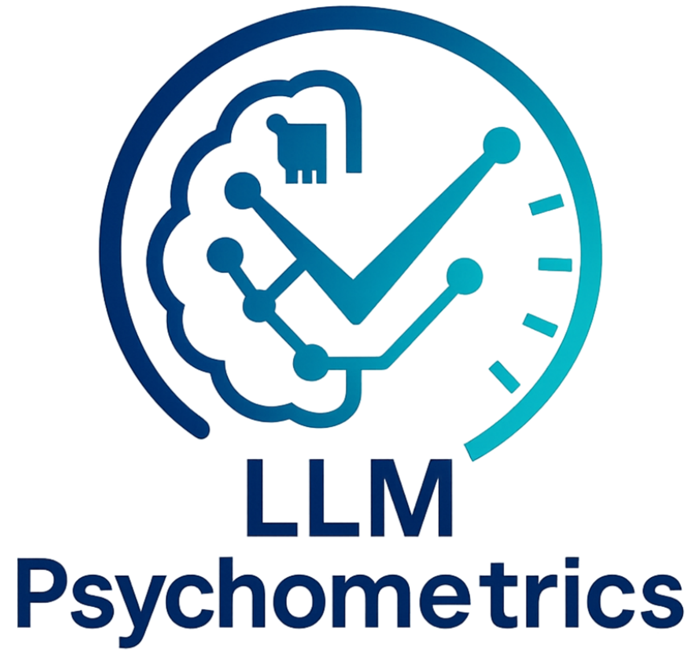

# 🎭 Awesome-LLM-Psychometrics

<p align="center">
  <a href="https://arxiv.org/abs/2505.08245">
    
  </a>
  
  
  
</p>


<p align="center">
  
</p>


> 🌐 **Project Website:** [https://llm-psychometrics.com](https://llm-psychometrics.com)


This repository accompanies the paper [Large Language Model Psychometrics: A Systematic Review of Evaluation, Validation, and Enhancement](https://arxiv.org/abs/2505.08245). It contains a curated list of Large Language Models (LLMs) psychometrics resources. We will continue to update this repository as we find new resources. We would greatly appreciate it if you could contribute to this repository by submitting a pull request or an issue.


---

## 📚 Table of Contents  

- 🧠 [Constructs & Categories](#-constructs--categories)  

- 📬 [Methodology and Validation Tags](#-methodology-and-validation-tags)  
  - 🔬 [Psychometric Evaluation Methodology](#-psychometric-evaluation-methodology)  
  - ✅ [Psychometric Validation](#-psychometric-validation)  

- 📝 [Category Entries](#-category-entries)  
  - 📂 [Personality](#-personality)  
  - 📂 [Values](#-values)  
  - 📂 [Morality](#-morality)  
  - 📂 [Attitudes & Opinions](#-attitudes--opinions)  
  - 📂 [Heuristics & Biases](#-heuristics--biases)  
  - 📂 [Social Intelligence & Theory of Mind](#-social-intelligence--theory-of-mind)  
  - 📂 [Psychology of Language](#-psychology-of-language)  
  - 📂 [Learning and Cognitive Capabilities](#-learning-and-cognitive-capabilities)  

---

## 📝 Citation

If you find this repository useful, we would greatly appreciate it if you could give us a star and cite the paper as follows:

```bibtex
@article{ye2025large,
  title={Large Language Model Psychometrics: A Systematic Review of Evaluation, Validation, and Enhancement},
  author={Ye, Haoran and Jin, Jing and Xie, Yuhang and Zhang, Xin and Song, Guojie},
  journal={arXiv preprint arXiv:2505.08245},
  year={2025},
  note={Project website: \url{https://llm-psychometrics.com}, GitHub: \url{https://github.com/ValueByte-AI/Awesome-LLM-Psychometrics}}
}
```


## 📄 TODO

- [ ] Add tags to each entry


## 🧠 Constructs & Categories  


### 📂 Personality - overview

- 🗯️ **Big Five	/	HEXACO	/	Myers-Briggs Type Indicator (MBTI)	/	Dark Triad	/	Others & custom**
- 🧪 **Personality** is the enduring configuration of characteristics and behavior that comprises an individual’s unique adjustment to life.

### 📂 Values - overview  

- ⚖️ **Schwartz’s Theory	/	World Values Survey (WVS)	/	Global Leadership and Organizational Behavior Effectiveness (GLOBE)	/	Social Value Orientation (SVO)	/	Others & custom**
- 🧪 **Values** are enduring beliefs that guide behavior and decision-making, reflecting what is important and desirable to an individual or group.

### 📂 Morality - overview  

- 🧬 **Moral Foundations (MFT) 	/	 Defining Issues Test (DIT)	/	ETHICS	/	Others & custom**
- 🧪 **Morality** is the categorization of intentions, decisions and actions into those that are proper, or right, and those that are improper, or wrong.

### 📂 Attitudes & Opinions - overview  

- 🗣️ **American National Election Studies (ANES)	/	 American Trends Panel(ATP)	/	German Longitudinal Election Study (GLES)	/	 Political Compass Test (PCT)**

- 🧪 **Attitudes** are always attitudes about something. This implies three necessary elements: first, there is the object of thought, which is both constructed and evaluated. Second, there are acts of construction and evaluation. Third, there is the agent, who is doing the constructing and evaluating. We can therefore suggest that, at its most general, an attitude is the cognitive construction and affective evaluation of an attitude object by an agent.

  

### 📂 Heuristics & Biases - overview

- 🧪  **Heuristics and biases** are mental shortcuts or rules of thumb that simplify decision-making and problem-solving.

### 📂 Social Intelligence & Theory of Mind - overview  

- 🌀 **Theory of Mind (ToM)	/	Emotional Intelligence	/	Social Intelligence**

- 🧪 **Theory of Mind** is the ability to attribute mental states such as beliefs, intentions, and knowledge to others.

  🧪 **Emotional Intelligence** is the subset of social intelligence that involves the ability to monitor one’s own and others’ feelings and emotions, to discriminate among them and to use this information to guide one’s thinking and actions.

  🧪 **Social Intelligence** is the ability to understand and manage people.

### 📂 Psychology of language - overview

- **🧑‍🤝‍🧑 Language  comprehension	/	Language generation	/	Language acquisition**

### 📂 Learning and cognitive capabilities - overview


---

## 📬 Methodology and Validation Tags  

### 🔬 Psychometric Evaluation Methodology


- **Test Format**: Structured test · Open-ended conversation · Agentic simulation 
- **Data and Task Sources**: Established inventories (e.g., MFT, SVS, MBTI) · Custom-curated items · Synthetic items 
- **Prompting Strategies**: Prompt perturbation · Performance-enhancing prompts (e.g., CoT) · Role-playing prompts 
- **Model Output & Scoring**: Logit-based analysis · Direct scoring · Rule-based scoring · Human scoring  · Model-based scoring

### ✅ Psychometric Validation


- **Reliability**: Test-retest · Parallel forms · Inter-rater agreement 

- **Content Validity**: Data contamination · Novel items 

- **Construct Validity**: Unique abstraction · Response set · Social Desirability Bias · Cross-lingual Tests 

- **Criterion / Ecological Validity**: External correlation · Real-world relevance  

  

---


## 📝 Category Entries  


### 📂 Related Survey

- **Humanizing LLMs: A Survey of Psychological Measurements with Tools, Datasets, and Human-Agent Applications**, 2025.04, [[paper](https://arxiv.org/abs/2505.00049)]

- **The Mind in the Machine: A Survey of Incorporating Psychological Theories in LLMs**, 2025.05, [[paper](https://arxiv.org/abs/2505.00003)]

- **A review of automatic item generation techniques leveraging large language models**, 2025.06, [[paper](https://dergipark.org.tr/en/pub/ijate/issue/90456/1602294)]

  

### 📂 Personality  

- (*Big Five*) **Is Self-knowledge and Action Consistent or Not: Investigating Large Language Model's Personality**, ICML 2024, [[paper](https://arxiv.org/abs/2402.14679)]
- (*Big Five*) **Can LLM Agents Maintain a Persona in Discourse?**, 2025.02, [[paper](https://arxiv.org/abs/2502.11843)]
- (*Big Five*) **Personality testing of large language models: limited temporal stability, but highlighted prosociality**, 2024.01, Royal Society Open Science, [[paper](https://royalsocietypublishing.org/doi/full/10.1098/rsos.240180)]
- (*Big Five*) **Identifying and Manipulating the Personality Traits of Language Models**, EMNLP 2023, [[paper](https://arxiv.org/abs/2212.10276)]
- (*Big Five*) **Do Personality Tests Generalize to Large Language Models?**, 2023.11, [[paper](https://openreview.net/forum?id=zKDSfGhCoK)]
- (*Big Five*) **LLM Agents in Interaction: Measuring Personality Consistency and Linguistic Alignment in Interacting Populations of Large Language Models**, EACL 2024, [[paper](https://arxiv.org/abs/2402.02896)]
- (*Big Five*) **PersonaLLM: Investigating the Ability of Large Language Models to Express Personality Traits**, NAACL 2024 Findings, [[paper](https://arxiv.org/abs/2305.02547)]
- (*Big Five*) **Eliciting Personality Traits in Large Language Models**, 2024.02, [[paper](https://arxiv.org/abs/2402.08341)]
- (*Big Five*) **Revisiting the Reliability of Psychological Scales on Large Language Models**, EMNLP 2024, [[paper](https://arxiv.org/abs/2305.19926)]
- (*Big Five*) **Evaluating and Inducing Personality in Pre-trained Language Models**, NeurIPS 2023, [[paper](https://proceedings.neurips.cc/paper_files/paper/2023/hash/21f7b745f73ce0d1f9bcea7f40b1388e-Abstract-Conference.html)]
- (*Big Five*) **Estimating the Personality of White-Box Language Models**, 2022.04, [[paper](https://arxiv.org/abs/2204.12000)]
- (*Big Five*) **Driving Generative Agents With Their Personality**, 2024.02, [[paper](https://arxiv.org/abs/2402.14879)]
- (*Big Five*) **Large Language Models as Superpositions of Cultural Perspectives**, 2023.07, [[paper](https://arxiv.org/abs/2307.07870)] [[code](https://gitlab.inria.fr/gkovac/value_stability)]
- (*Big Five*) **Open Models, Closed Minds? On Agents Capabilities in Mimicking Human Personalities through Open Large Language Model**, AAAI 2025, [[paper](https://ojs.aaai.org/index.php/AAAI/article/view/32125)] 
- (*Big Five*) **Do LLMs Have Distinct and Consistent Personality? TRAIT: Personality Testset designed for LLMs with Psychometrics**, NAACL 2025 Findings, [[paper](https://arxiv.org/abs/2406.14703)] 
- (*Big Five*) **Evaluating Psychological Safety of Large Language Models**, EMNLP 2024, [[paper](https://arxiv.org/abs/2212.10529)]
- (*Big Five*) **Dynamic Generation of Personalities with Large Language Models**, 2024.04, [[paper](https://arxiv.org/abs/2404.07084)] 
- (*Big Five*) **Illuminating the Black Box: A Psychometric Investigation into the Multifaceted Nature of Large Language Models**, 2023.12, [[paper](https://arxiv.org/abs/2312.14202)]
- (*Big Five*) **AI Psychometrics: Assessing the Psychological Profiles of Large Language Models Through Psychometric Inventories**, 2023.01, Perspectives on Psychological Science, [[paper](https://journals.sagepub.com/doi/full/10.1177/17456916231214460)]
- (*Big Five*) **Limited Ability of LLMs to Simulate Human Psychological Behaviours: a Psychometric Analysis**, 2024.05, [[paper](https://arxiv.org/abs/2405.07248)]
- (*Big Five*) **ValueBench: Towards Comprehensively Evaluating Value Orientations and Understanding of Large Language Models**, ACL 2024, [[paper](https://arxiv.org/abs/2406.04214)] [[code](https://github.com/Value4AI/ValueBench)] 
- (*Big Five*) **Do GPT Language Models Suffer From Split Personality Disorder? The Advent Of Substrate-Free Psychometrics**, 2024.08, [[paper](https://arxiv.org/abs/2408.07377)]
- (*Big Five*) **Personality Traits in Large Language Models**, 2023.08, [[paper](https://www.researchsquare.com/article/rs-3296728/v1)]
- (*Big Five*) **You don't need a personality test to know these models are unreliable: Assessing the Reliability of Large Language Models on Psychometric Instruments**, NAACL 2024, [[paper](https://arxiv.org/abs/2311.09718)] 
- (*Big Five*) **Have Large Language Models Developed a Personality?: Applicability of Self-Assessment Tests in Measuring Personality in LLMs**, 2023.05, [[paper](https://arxiv.org/abs/2305.14693)]
- (*Big Five*) **Challenging the Validity of Personality Tests for Large
  Language Models**, Workshop at NeurIPS 2023, [[paper](https://tomsuehr.com/wp-content/uploads/2024/06/challenging_the_validity_of_personality_tests_on_llms.pdf)] 
- (*Big Five*) **LMLPA: Language Model Linguistic Personality Assessment**, 2025.01, Computational Linguistics, [[paper](https://direct.mit.edu/coli/article/doi/10.1162/coli_a_00550/127544)] 
- (*Big Five*) **Dynamic Evaluation of Large Language Models by Meta Probing Agents**, ICML 2024, [[paper](https://arxiv.org/abs/2402.14865)] [[code](https://github.com/microsoft/promptbench)] 
- (*Big Five*) **Value Portrait: Assessing Language Models' Values through Psychometrically and Ecologically Valid Items**, ACL 2025, [[paper](https://arxiv.org/abs/2505.01015)]
- (*Big Five*) **Toward Accurate Psychological Simulations: Investigating LLMs’ Responses to Personality and Cultural Variables**, Computers in Human Behavior 2025, [[paper](https://www.sciencedirect.com/science/article/abs/pii/S0747563225001347)]
- (*Big Five*) **Personality-Driven Decision-Making in LLM-Based Autonomous Agents**, AAMAS 2025, [[paper](https://arxiv.org/abs/2504.00727)]
- (*Big Five*) **Large Language Models Demonstrate Distinct Personality Profiles**, Cureus 2025, [[paper](https://assets.cureus.com/uploads/original_article/pdf/372671/20250524-330887-txlcnn.pdf)]
- (*Big Five*) **Beyond Self-Reports: Multi-Observer Agents for Personality Assessment in Large Language Models**, 2025.04, [[paper](https://arxiv.org/abs/2504.08399)]
- (*Big Five*) **Persona Dynamics: Unveiling the Impact of Personality Traits on Agents in Text-Based Games**, 2025.04, [[paper](https://arxiv.org/abs/2504.06868)]
- (*Big Five*) **Improving Language Model Personas via Rationalization with Psychological Scaffolds**, 2025.04, [[paper](https://arxiv.org/abs/2504.17993)]
- (*HEXACO*) **On the Psychology of GPT-4: Moderately anxious, slightly masculine, honest, and humble**, 2024.02, [[paper](https://arxiv.org/abs/2402.01777)]
- (*HEXACO*) **Personality testing of large language models: limited temporal stability, but highlighted prosociality**, 2024.01, Royal Society Open Science, [[paper](https://royalsocietypublishing.org/doi/full/10.1098/rsos.240180)] 
- (*HEXACO*) **Who is GPT-3? An Exploration of Personality, Values and Demographics**, EMNLP 2022 NLP+CSS workshop, [[paper](https://arxiv.org/abs/2209.14338)]
- (*HEXACO*) **Cognitive phantoms in LLMs through the lens of latent variables**, 2024.09, [[paper](https://arxiv.org/abs/2409.15324)]
- (*HEXACO*) **ValueBench: Towards Comprehensively Evaluating Value Orientations and Understanding of Large Language Models**, ACL 2024, [[paper](https://arxiv.org/abs/2406.04214)][[code](https://github.com/Value4AI/ValueBench)] 
- (*HEXACO*) **Exploring the Impact of Personality Traits on LLM Bias and Toxicity**, 2025.02, [[paper](https://arxiv.org/abs/2502.12566)]
- (*MBTI*) **Machine Mindset: An MBTI Exploration of Large Language Models**, 2023.12, [[paper](https://arxiv.org/abs/2312.12999 )][[code](https://github.com/PKU-YuanGroup/Machine-Mindset)]
- (*MBTI*) **Revisiting the Reliability of Psychological Scales on Large Language Models**, EMNLP 2024, [[paper](https://arxiv.org/abs/2305.19926)]
- (*MBTI*) **Open Models, Closed Minds? On Agents Capabilities in Mimicking Human Personalities through Open Large Language Models**, AAAI 2025, [[paper](https://ojs.aaai.org/index.php/AAAI/article/view/32125)] 
- (*MBTI*) **Illuminating the Black Box: A Psychometric Investigation into the Multifaceted Nature of Large Language Models**, 2023.12, [[paper](https://arxiv.org/abs/2312.14202)]
- (*MBTI*) **Do LLMs Possess a Personality? Making the MBTI Test an Amazing Evaluation for Large Language Models**, 2023.07, [[paper](https://arxiv.org/abs/2307.16180)][[code](https://github.com/HarderThenHarder/transformers_tasks/tree/main/LLM/llms_mbti)]
- (*MBTI*) **Can ChatGPT Assess Human Personalities? A General Evaluation Framework**, 2023.03, [[paper](https://arxiv.org/abs/2303.01248)][[code](https://github.com/Kali-Hac/ChatGPT-MBTI)]
- (*MBTI*) **Identifying Multiple Personalities in Large Language Models with External Evaluation**, 2024.02, [[paper](https://arxiv.org/abs/2402.14805)]
- (*MBTI*) **The Better Angels of Machine Personality: How Personality Relates to LLM Safety**, 2024.07, [[paper](https://arxiv.org/abs/2407.12344)]
- (*MBTI*) **Do Large Language Models Have a Personality? A Psychometric Evaluation with Implications for Clinical Medicine and Mental Health AI**, 2025.03, [[paper](https://www.medrxiv.org/content/10.1101/2025.03.14.25323987v1https://www.medrxiv.org/content/10.1101/2025.03.14.25323987v1)]
- (*DarkTriad*) **On the Psychology of GPT-4: Moderately anxious, slightly masculine, honest, and humble**, 2024.02, [[paper](https://arxiv.org/abs/2402.01777)]
- (*DarkTriad*) **Who is ChatGPT? Benchmarking LLMs' Psychological Portrayal Using PsychoBench**, ICLR 2024 Oral, [[paper](https://arxiv.org/abs/2310.01386)][[code](https://github.com/CUHK-ARISE/PsychoBench)]
- (*DarkTriad*) **Do LLMs Have Distinct and Consistent Personality? TRAIT: Personality Testset designed for LLMs with Psychometrics**, NAACL 2025 Findings, [[paper](https://arxiv.org/abs/2406.14703)] 
- (*DarkTriad*) **Evaluating Psychological Safety of Large Language Models**, 2022.12, [[paper](https://arxiv.org/abs/2212.10529)]
- (*DarkTriad*) **Illuminating the Black Box: A Psychometric Investigation into the Multifaceted Nature of Large Language Models**, 2023.12, [[paper](https://arxiv.org/abs/2312.14202)]
- (*DarkTriad*) **Cognitive phantoms in LLMs through the lens of latent variables**, 2024.09, [[paper](https://arxiv.org/abs/2409.15324)]
- (*DarkTriad*) **Do GPT Language Models Suffer From Split Personality Disorder? The Advent Of Substrate-Free Psychometrics**, 2024.08, [[paper](https://arxiv.org/abs/2408.07377)]
- (*DarkTriad*) **I'm Sorry Dave: How the old world of personnel security can inform the new world of AI insider risk**, 2025.05, [[paper](https://arxiv.org/abs/2504.00012)]
- (*DarkTriad*) **Persona Dynamics: Unveiling the Impact of Personality Traits on Agents in Text-Based Games**, 2025.04, [[paper](https://arxiv.org/abs/2504.06868)]
- (*Others & custom*) **Self-assessment, Exhibition, and Recognition: a Review of Personality in Large Language Models**, 2024.06, [[paper](https://arxiv.org/abs/2406.17624)]
- (*Others & custom*) **Is Self-knowledge and Action Consistent or Not: Investigating Large Language Model's Personality**, ICML 2024, [[paper](https://arxiv.org/abs/2402.14679)]
- (*Others & custom*) **Evaluating and Inducing Personality in Pre-trained Language Models**, NeurIPS 2023, [[paper](https://proceedings.neurips.cc/paper_files/paper/2023/hash/21f7b745f73ce0d1f9bcea7f40b1388e-Abstract-Conference.html)]
- (*Others & custom*) **Editing Personality For Large Language Models**, NLPCC 2024, [[paper](https://link.springer.com/chapter/10.1007/978-981-97-9434-8_19)]
- (*Others & custom*) **Quantifying Risk Propensities of Large Language Models: Ethical Focus and Bias Detection through Role-Play**, CogSci 2025, [[paper](https://arxiv.org/abs/2411.08884)] 
- (*Others & custom*) **PersonaBench: Evaluating AI Models on Understanding Personal Information through Accessing (Synthetic) Private User Data**, 2025.02, [[paper](https://arxiv.org/abs/2502.20616)] 

### 📂 Values  

- (*Schwartz*) **High-Dimension Human Value Representation in Large Language Models**, 2024.04, [[paper](https://arxiv.org/abs/2404.07900)]
- (*Schwartz*) **What does ChatGPT return about human values? Exploring value bias in ChatGPT using a descriptive value theory**, 2023.04, [[paper](https://arxiv.org/abs/2304.03612)]
- (*Schwartz*) **Assessing the Alignment of Large Language Models With Human Values for Mental Health Integration: Cross-Sectional Study Using Schwartz’s Theory of Basic Values**, 2024.01, JMIR Mental Health, [[paper](https://mental.jmir.org/2024/1/e55988)]
- (*Schwartz*) **Large Language Models as Superpositions of Cultural Perspectives**, 2023.07, [[paper](https://arxiv.org/abs/2307.07870)]
- (*Schwartz*) **When Prompting Fails to Sway: Inertia in Moral and Value Judgments of Large Language Models**, NeurIPS 2022, [[paper](https://arxiv.org/abs/2408.09049)] 
- (*Schwartz*) **Value-Spectrum: Quantifying Preferences of Vision-Language Models via Value Decomposition in Social Media Contexts**, 2024.11, [[paper](https://arxiv.org/abs/2411.11479)]
- (*Schwartz*) **Who is GPT-3? An Exploration of Personality, Values and Demographics**, EMNLP 2022 NLP+CSS workshop, [[paper](https://arxiv.org/abs/2209.14338)]
- (*Schwartz*) **AI Psychometrics: Assessing the Psychological Profiles of Large Language Models Through Psychometric Inventories**, 2023.01, Perspectives on Psychological Science, [[paper](https://journals.sagepub.com/doi/full/10.1177/17456916231214460)] 
- (*Schwartz*) **ValueBench: Towards Comprehensively Evaluating Value Orientations and Understanding of Large Language Models**, ACL 2024, [[paper](https://arxiv.org/abs/2406.04214)][[code](https://github.com/Value4AI/ValueBench)] 
- (*Schwartz*) **Do LLMs have Consistent Values?**, 2024.07, [[paper](https://arxiv.org/abs/2407.12878)]
- (*Schwartz*) **ValueCompass: A Framework for Measuring Contextual Value Alignment Between Human and LLMs**, 2024.09, [[paper](https://arxiv.org/abs/2409.09586)] 
- (*Schwartz*) **Value FULCRA: Mapping Large Language Models to the Multidimensional Spectrum of Basic Human Values**, ACL 2024, [[paper](https://arxiv.org/abs/2311.10766)]
- (*Schwartz*) **Measuring Human and AI Values Based on Generative Psychometrics with Large Language Models**, AAAI 2025, [[paper](https://ojs.aaai.org/index.php/AAAI/article/view/34839)]
- (*Schwartz*) **ValueDCG: Measuring Comprehensive Human Value Understanding Ability of Language Models**, 2023.10, [[paper](https://arxiv.org/abs/2310.00378)]
- (*Schwartz*) **Value Portrait: Assessing Language Models' Values through Psychometrically and Ecologically Valid Items**, ACL 2025, [[paper](https://arxiv.org/abs/2505.01015)]
- (*Schwartz*) **Cultural Value Alignment in Large Language Models: A Prompt-based Analysis of Schwartz Values in Gemini, ChatGPT, and DeepSeek**, 2025.05, [[paper](https://arxiv.org/abs/2505.17112)]
- (*Schwartz*) **The Staircase of Ethics: Probing LLM Value Priorities through Multi-Step Induction to Complex Moral Dilemmas**, 2025.05, [[paper](https://arxiv.org/abs/2505.18154)]
- (*Schwartz*) **Improving Language Model Personas via Rationalization with Psychological Scaffolds**, 2025.04, [[paper](https://arxiv.org/abs/2504.17993)]
- (*WVS*) **ValueDCG: Measuring Comprehensive Human Value Understanding Ability of Language Models**, 2023.10, [[paper](https://arxiv.org/abs/2310.00378)]
- (*WVS*) **Only a Little to the Left: A Theory-grounded Measure of Political Bias in Large Language Models**, 2025.03, [[paper](https://arxiv.org/abs/2503.16148)]
- (*WVS*) **Exploring Large Language Models on Cross-Cultural Values in Connection with Training Methodology**, 2024.12, [[paper](https://arxiv.org/abs/2412.08846)]
- (*WVS*) **Value Compass Leaderboard: A Platform for Fundamental and Validated Evaluation of LLMs Values**, 2025.01, [[paper](https://arxiv.org/abs/2501.07071)]
- (*VSM*) **How Well Do LLMs Represent Values Across Cultures? Empirical Analysis of LLM Responses Based on Hofstede Cultural Dimensions**, 2024.06, [[paper](https://arxiv.org/abs/2406.14805)]
- (*VSM*) **Large Language Models as Superpositions of Cultural Perspectives**, 2023.07, [[paper](https://arxiv.org/abs/2307.07870)][[code](https://gitlab.inria.fr/gkovac/value_stability)]
- (*VSM*) **ValueBench: Towards Comprehensively Evaluating Value Orientations and Understanding of Large Language Models**, ACL 2024, [[paper](https://arxiv.org/abs/2406.04214)][[code](https://github.com/Value4AI/ValueBench)] 
- (*VSM*) **Measuring Human and AI Values Based on Generative Psychometrics with Large Language Models**, AAAI 2025, [[paper](https://ojs.aaai.org/index.php/AAAI/article/view/34839)]
- (*VSM*) **Cultural Value Differences of LLMs: Prompt, Language, and Model Size**, 2024.07, [[paper](https://arxiv.org/abs/2407.16891)]
- (*GLOBE*) **LLM-GLOBE: A Benchmark Evaluating the Cultural Values Embedded in LLM Output**, 2024.11, [[paper](https://arxiv.org/abs/2411.06032)]
- (*GLOBE*) **Quantifying AI Psychology: A Psychometrics Benchmark for Large Language Models**, 2024.06, [[paper](https://arxiv.org/abs/2406.17675)]
- (*GLOBE*) **ValueBench: Towards Comprehensively Evaluating Value Orientations and Understanding of Large Language Models**, ACL 2024, [[paper](https://arxiv.org/abs/2406.04214)][[code](https://github.com/Value4AI/ValueBench)]
- (*SVO*) **Heterogeneous Value Alignment Evaluation for Large Language Models**, AAAI 2024 Workshop, [[paper](https://arxiv.org/abs/2305.17147)][[code](https://github.com/zowiezhang/HVAE)] 
- (*Others & custom*) **Beyond Human Norms: Unveiling Unique Values of Large Language Models through Interdisciplinary Approaches**, 2024.04, [[paper](https://arxiv.org/abs/2404.12744)]
- (*Others & custom*) **Raising the Bar: Investigating the Values of Large Language Models via Generative Evolving Testing**, 2024.06, [[paper](https://arxiv.org/abs/2406.14230)]
- (*Others & custom*) **Quantifying AI Psychology: A Psychometrics Benchmark for Large Language Models**, 2024.06, [[paper](https://arxiv.org/abs/2406.17675)]
- (*Others & custom*) **Measuring Spiritual Values and Bias of Large Language Models**, 2024.10, [[paper](https://arxiv.org/abs/2410.11647)]
- (*Others & custom*) **LocalValueBench: A Collaboratively Built and Extensible Benchmark for Evaluating Localized Value Alignment and Ethical Safety in Large Language Models**, 2024.08, [[paper](https://arxiv.org/abs/2408.01460)]
- (*Others & custom*) **Are Large Language Models Consistent over Value-laden Questions?**, EMNLP 2024, [[paper](https://arxiv.org/abs/2407.02996)] 
- (*Others & custom*) **CValues: Measuring the Values of Chinese Large Language Models from Safety to Responsibility**, 2023.07, [[paper](https://arxiv.org/abs/2307.09705)]
- (*Others & custom*) **DO MINDFULNESS ACTIVITIES IMPROVE HANDGRIP STRENGTH AMONG OLDER ADULTS: A PROPENSITY SCORE MATCHING APPROACH**, 2024.12, Innovation in Aging, [[paper](https://academic.oup.com/innovateage/article/8/Supplement_1/1010/7939280?login=false)] 
- (*Others & custom*) **Values in the Wild: Discovering and Analyzing Values in Real-World Language Model Interactions**, 2025.04, [[paper](https://arxiv.org/abs/2504.15236)]
- (*Others & custom*) **Will AI Tell Lies to Save Sick Children? Litmus-Testing AI Values Prioritization with AIRiskDilemmas**, 2025.05, [[paper](https://arxiv.org/abs/2505.14633)]
- (*Others & custom*) **EAVIT: Efficient and Accurate Human Value Identification from Text data via LLMs**, 2025.05, [[paper](https://arxiv.org/abs/2505.12792)]
- (*Others & custom*) **Do Language Models Think Consistently? A Study of Value Preferences Across Varying Response Lengths**, 2025.06, [[paper](https://arxiv.org/abs/2506.02481)]
- (*Others & custom*) **Measurement of LLM’s Philosophies of Human Nature**, 2025.04, [[paper](https://arxiv.org/pdf/2504.02304)] [[code](https://github.com/kodenii/M-PHNS)]

### 📂 Morality

- (*MFT*) **Moral Foundations of Large Language Models**, EMNLP 2024, [[paper](https://arxiv.org/abs/2310.15337)] 
- (*MFT*) **Whose Morality Do They Speak? Unraveling Cultural Bias in Multilingual Language Models**, 2024.12, [[paper](https://arxiv.org/abs/2412.18863)] 
- (*MFT*) **Does Moral Code Have a Moral Code? Probing Delphi's Moral Philosophy**, NAACL 2022 Workshop, [[paper](https://arxiv.org/abs/2205.12771)] 
- (*MFT*) **MoralBench: Moral Evaluation of LLMs**, 2024.06, [[paper](https://arxiv.org/abs/2406.04428)][[code](https://github.com/agiresearch/MoralBench)]
- (*MFT*) **Towards "Differential AI Psychology" and in-context Value-driven Statement Alignment with Moral Foundations Theory**, 2024.08, [[paper](https://arxiv.org/abs/2408.11415)]
- (*MFT*) **Analyzing the Ethical Logic of Six Large Language Models**, 2025.01, [[paper](https://arxiv.org/abs/2501.08951)]
- (*MFT*) **Are Large Language Models Moral Hypocrites? A Study Based on Moral Foundations**, AIES 2024, [[paper](https://ojs.aaai.org/index.php/AIES/article/view/31704)] 
- (*MFT*) **AI Psychometrics: Assessing the Psychological Profiles of Large Language Models Through Psychometric Inventories**, 2023.01, Perspectives on Psychological Science, [[paper](https://journals.sagepub.com/doi/full/10.1177/17456916231214460)][[code](https://github.com/feradauto/MoralCoT)] 
- (*MFT*) **Moral Mimicry: Large Language Models Produce Moral Rationalizations Tailored to Political Identity**, ACL 2023 Workshop, [[paper](https://arxiv.org/abs/2209.12106)] 
- (*MFT*) **Exploring and steering the moral compass of Large Language Models**, ICPR 2024, [[paper](https://arxiv.org/abs/2405.17345)] 
- (*MFT*) **M3oralBench: A MultiModal Moral Benchmark for LVLMs**, 2024.12, [[paper](https://arxiv.org/abs/2412.20718)]
- (*MFT*) **CLAVE: An Adaptive Framework for Evaluating Values of LLM Generated Responses**, NeurIPS 2024, [[paper](https://arxiv.org/abs/2407.10725)] 
- (*MFT*) **Rethinking Machine Ethics -- Can LLMs Perform Moral Reasoning through the Lens of Moral Theories?**, NAACL 2024 Findings, [[paper](https://arxiv.org/abs/2308.15399)] 
- (*MFT*) **The Staircase of Ethics: Probing LLM Value Priorities through Multi-Step Induction to Complex Moral Dilemmas**, 2025.05, [[paper](https://arxiv.org/abs/2505.18154)]
- (*ETHICS*) **Despite "super-human" performance, current LLMs are unsuited for decisions about ethics and safety**, NeurIPS 2022 Workshop, [[paper](https://arxiv.org/abs/2212.06295)]
- (*ETHICS*) **Inducing Human-like Biases in Moral Reasoning Language Models**, 2024.11, [[paper](https://arxiv.org/abs/2411.15386)]
- (*ETHICS*) **An Evaluation of GPT-4 on the ETHICS Dataset**, 2023.09, [[paper](https://arxiv.org/abs/2309.10492)]
- (*ETHICS*) **EALM: Introducing Multidimensional Ethical Alignment in Conversational Information Retrieval**, SIGIR-AP 2023, [[paper](https://dl.acm.org/doi/abs/10.1145/3624918.3625327)][[code](https://github.com/wanng-ide/ealm)] 
- (*DIT*) **Do Moral Judgment and Reasoning Capability of LLMs Change with Language? A Study using the Multilingual Defining Issues Test**, 2024.02, [[paper](https://arxiv.org/abs/2402.02135)]
- (*DIT*) **Probing the Moral Development of Large Language Models through Defining Issues Test**, 2023.09, [[paper](https://arxiv.org/abs/2309.13356)]
- (*Others & Custom*) **Large-scale moral machine experiment on large language models**, 2024.11, [[paper](https://arxiv.org/abs/2411.06790)]
- (*Others & Custom*) **SaGE: Evaluating Moral Consistency in Large Language Models**, LREC-COLING 2024, [[paper](https://arxiv.org/abs/2402.13709)]
- (*Others & Custom*) **DailyDilemmas: Revealing Value Preferences of LLMs with Quandaries of Daily Life**, 2024.10, [[paper](https://arxiv.org/abs/2410.02683)]
- (*Others & Custom*) **The Moral Turing Test: Evaluating Human-LLM Alignment in Moral Decision-Making**,2024.10, [[paper](https://arxiv.org/abs/2410.07304)]
- (*Others & Custom*) **Potential benefits of employing large language models in research in moral education and development**, 2023.01, Journal of Moral Education, [[paper](https://www.tandfonline.com/doi/abs/10.1080/03057240.2023.2250570)]
- (*Others & Custom*) **Moral Persuasion in Large Language Models: Evaluating Susceptibility and Ethical Alignment**, 2024.11, [[paper](https://arxiv.org/abs/2411.11731)]
- (*Others & Custom*) **Raising the Bar: Investigating the Values of Large Language Models via Generative Evolving Testing**, 2024.06, [[paper](https://arxiv.org/abs/2406.14230)]
- (*Others & Custom*) **When to Make Exceptions: Exploring Language Models as Accounts of Human Moral Judgment**, NeurIPS 2022, [[paper](https://proceedings.neurips.cc/paper_files/paper/2022/hash/b654d6150630a5ba5df7a55621390daf-Abstract-Conference.html)][[code](https://github.com/feradauto/MoralCoT)] 
- (*Others & Custom*) **Does Cross-Cultural Alignment Change the Commonsense Morality of Language Models?**, C3NLP 2024, [[paper](https://arxiv.org/abs/2406.16316)] 
- (*Others & Custom*) **Western, Religious or Spiritual: An Evaluation of Moral Justification in Large Language Models**, 2023.11, [[paper](https://arxiv.org/abs/2311.07792)]
- (*Others & Custom*) **Evaluating Moral Beliefs across LLMs through a Pluralistic Framework**, 2024.11, [[paper](https://arxiv.org/abs/2411.03665)]
- (*Others & Custom*) **LLMs as mirrors of societal moral standards: reflection of cultural divergence and agreement across ethical topics**, 2024.12, [[paper](https://arxiv.org/abs/2412.00962)]
- (*Others & Custom*) **Analyzing the Ethical Logic of Six Large Language Model**, 2025.01, [[paper](https://arxiv.org/abs/2501.08951)]
- (*Others & Custom*) **Extended Japanese Commonsense Morality Dataset with Masked Token and Label Enhancement**, CIKM '24 (Short Paper), [[paper](https://dl.acm.org/doi/abs/10.1145/3627673.3679924)] 
- (*Others & Custom*) **What does AI consider praiseworthy?**, 2025.02, AI and Ethics, [[paper](https://link.springer.com/article/10.1007/s43681-025-00682-z)]
- (*Others & Custom*) **Knowledge of cultural moral norms in large language models**, ACL 2023, [[paper](https://arxiv.org/abs/2306.01857)]
- (*Others & Custom*) **Normative Evaluation of Large Language Models with Everyday Moral Dilemmas**, 2025.01, [[paper](https://arxiv.org/abs/2501.18081)]
- (*Others & Custom*) **Evaluating the Moral Beliefs Encoded in LLMs**, NeurIPS 2023, [[paper](https://proceedings.neurips.cc/paper_files/paper/2023/hash/a2cf225ba392627529efef14dc857e22-Abstract-Conference.html)] 
- (*Others & Custom*) **The Moral Mind(s) of Large Language Models**, 2024.12, [[paper](https://arxiv.org/abs/2412.04476)]
- (*Others & Custom*) **The moral machine experiment on large language models**, 2024.02, Royal Society Open Science, [[paper](https://royalsocietypublishing.org/doi/full/10.1098/rsos.231393)] 
- (*Others & Custom*) **Probing the Moral Development of Large Language Models through Defining Issues Test**, 2023.09, [[paper](https://arxiv.org/abs/2309.13356)]
- (*Others & Custom*) **Decoding Multilingual Moral Preferences: Unveiling LLM's Biases through the Moral Machine Experiment**, AIES 2024, [[paper](https://ojs.aaai.org/index.php/AIES/article/view/31741)] 
- (*Others & Custom*) **Right vs. Right: Can LLMs Make Tough Choices?**, 2024.12, [[paper](https://arxiv.org/abs/2412.19926)]

### 📂 Attitudes&opinions

- (*ANES*) **Out of One, Many: Using Language Models to Simulate Human Samples**, 2023.02, Political Analysis, [[paper](https://www.cambridge.org/core/journals/political-analysis/article/abs/out-of-one-many-using-language-models-to-simulate-human-samples/035D7C8A55B237942FB6DBAD7CAA4E49)] 
- (*ANES*) **Synthetic Replacements for Human Survey Data? The Perils of Large Language Models**, 2024.05, Political Analysis, [[paper](https://www.cambridge.org/core/journals/political-analysis/article/synthetic-replacements-for-human-survey-data-the-perils-of-large-language-models/B92267DC26195C7F36E63EA04A47D2FE)]
- (*ANES*) **CommunityLM: Probing Partisan Worldviews from Language Models**, COLING 2022, [[paper](https://arxiv.org/abs/2209.07065)] 
- (*ANES*) **Representation Bias in Political Sample Simulations with Large Language Models**, 2024.07, [[paper](https://arxiv.org/abs/2407.11409)]
- (*ANES*) **Random Silicon Sampling: Simulating Human Sub-Population Opinion Using a Large Language Model Based on Group-Level Demographic Information**, 2024.02, [[paper](https://arxiv.org/abs/2402.18144)]
- (*ANES*) **Unpacking Political Bias in Large Language Models: A Cross-Model Comparison on U.S. Politics**, 2024.12, [[paper](https://arxiv.org/abs/2412.16746)]
- (*ATP*) **Out of One, Many: Using Language Models to Simulate Human Samples**, 2023.02, Political Analysis, [[paper](https://www.cambridge.org/core/journals/political-analysis/article/abs/out-of-one-many-using-language-models-to-simulate-human-samples/035D7C8A55B237942FB6DBAD7CAA4E49)]
- (*ATP*) **Whose Opinions Do Language Models Reflect?**, ICML 2023, [[paper](https://proceedings.mlr.press/v202/santurkar23a.html)] 
- (*ATP*) **Do LLMs Exhibit Human-like Response Biases? A Case Study in Survey Design**, 2024.09, Transactions of the Association for Computational Linguistics (TACL), [[paper](https://direct.mit.edu/tacl/article/doi/10.1162/tacl_a_00685/124261)]
- (*GLES*) **Human Preferences in Large Language Model Latent Space: A Technical Analysis on the Reliability of Synthetic Data in Voting Outcome Prediction**, 2025.02, [[paper](https://arxiv.org/abs/2502.16280)]
- (*GLES*) **Algorithmic Fidelity of Large Language Models in Generating Synthetic German Public Opinions: A Case Study**, 2024.12, [[paper](https://arxiv.org/abs/2412.13169)]
- (*GLES*) **Representation Bias in Political Sample Simulations with Large Language Models**, 2024.07, [[paper](https://arxiv.org/abs/2407.11409)]
- (*GLES*) **Vox Populi, Vox AI? Using Language Models to Estimate German Public Opinion**, 2024.07, [[paper](https://arxiv.org/abs/2407.08563)]
- (*PCT*) **PRISM: A Methodology for Auditing Biases in Large Language Models**, 2024.10, [[paper](https://arxiv.org/abs/2410.18906)]
- (*PCT*) **Mapping and Influencing the Political Ideology of Large Language Models using Synthetic Personas**, 2024.12, [[paper](https://arxiv.org/abs/2412.14843)]
- (*PCT*) **The political ideology of conversational AI: Converging evidence on ChatGPT's pro-environmental, left-libertarian orientation**, 2023.01, [[paper](https://arxiv.org/abs/2301.01768)]
- (*PCT*) **Political Compass or Spinning Arrow? Towards More Meaningful Evaluations for Values and Opinions in Large Language Models**, ACL 2024, [[paper](https://arxiv.org/abs/2402.16786)] 
- (*PCT*) **The Political Biases of ChatGPT**, 2023.01, Social Sciences, [[paper](https://www.mdpi.com/2076-0760/12/3/148)] 
- (*PCT*) **The Self-Perception and Political Biases of ChatGPT**, 2024.07, [[paper](https://onlinelibrary.wiley.com/doi/full/10.1155/2024/7115633)]
- (*PCT*) **Revealing Fine-Grained Values and Opinions in Large Language Models**, EMNLP 2024 Findings, [[paper](https://arxiv.org/abs/2406.19238)] 
- (*Others & custom*) **The Potential and Challenges of Evaluating Attitudes, Opinions, and Values in Large Language Models**, EMNLP 2024 Findings, [[paper](https://arxiv.org/abs/2406.11096)] 
- (*Others & custom*) **Beyond Prompt Brittleness: Evaluating the Reliability and Consistency of Political Worldviews in LLMs**, 2024.11, Transactions of the Association for Computational Linguistics (TACL), [[paper](https://direct.mit.edu/tacl/article/doi/10.1162/tacl_a_00710/125176)]
- (*Others & custom*) **Llama meets EU: Investigating the European Political Spectrum through the Lens of LLMs**, NAACL 2024 (Short Paper), [[paper](https://arxiv.org/abs/2403.13592)] 
- (*Others & custom*) **Questioning the Survey Responses of Large Language Models**, NeurIPS 2024, [[paper](https://proceedings.neurips.cc/paper_files/paper/2024/hash/515c62809e0a29729d7eec26e2916fc0-Abstract-Conference.html)]
- (*Others & custom*) **Towards Measuring the Representation of Subjective Global Opinions in Language Models**, 2023.06, [[paper](https://arxiv.org/abs/2306.16388)][[code](https://huggingface.co/datasets/Anthropic/llm_global_opinions)]
- (*Others & custom*) **Only a Little to the Left: A Theory-grounded Measure of Political Bias in Large Language Models**, 2025.03, [[paper](https://arxiv.org/abs/2503.16148)]
- (*Others & custom*) **From Pretraining Data to Language Models to Downstream Tasks: Tracking the Trails of Political Biases Leading to Unfair NLP Models**, ACL 2023, [[paper](https://arxiv.org/abs/2305.08283)]
- (*Others & custom*) **Are Large Language Models Chameleons? An Attempt to Simulate Social Surveys**, 2024.05, [[paper](https://arxiv.org/abs/2405.19323)] 
- (*Others & custom*) **Improving GPT Generated Synthetic Samples with Sampling-Permutation Algorithm**, 2023.08, [[paper](https://papers.ssrn.com/sol3/papers.cfm?abstract_id=4548937)]
- (*Others & custom*) **AI-Augmented Surveys: Leveraging Large Language Models and Surveys for Opinion Prediction**, 2023.05, [[paper](https://arxiv.org/abs/2305.09620)]
- (*Others & custom*) **Linear Representations of Political Perspective Emerge in Large Language Models**, 2025.03, [[paper](https://arxiv.org/abs/2503.02080)]
- (*Others & custom*) **Can large language models estimate public opinion about global warming? An empirical assessment of algorithmic fidelity and bias**, 2024.08, PLOS Climate, [[paper](https://journals.plos.org/climate/article?id=10.1371/journal.pclm.0000429&utm)] 
- (*Others & custom*) **How Accurate are GPT-3’s Hypotheses About Social Science Phenomena?**, 2023.07, Digital Society, [[paper](https://link.springer.com/article/10.1007/s44206-023-00054-2)]
- (*Others & custom*) **IssueBench: Millions of Realistic Prompts for Measuring Issue Bias in LLM Writing Assistance**, 2025.02, [[paper](https://arxiv.org/abs/2502.08395)]
- (*Others & custom*) **The Political Biases of ChatGPT**, 2023.01, Social Sciences, [[paper](https://www.mdpi.com/2076-0760/12/3/148)]
- (*Others & custom*) **Demonstrations of the Potential of AI-based Political Issue Polling**, 2023.07, Harvard Data Science Review (HDSR), [[paper](https://arxiv.org/abs/2307.04781)] 
- (*Others & custom*) **Large Language Models Can Be Used to Estimate the Latent Positions of Politicians**, 2023.03, [[paper](https://arxiv.org/abs/2303.12057)]
- (*Others & custom*) **Better Aligned with Survey Respondents or Training Data? Unveiling Political Leanings of LLMs on U.S. Supreme Court Cases**, 2025.02, [[paper](https://arxiv.org/abs/2502.18282)]
- (*Others & custom*) **Are LLMs (Really) Ideological? An IRT-based Analysis and Alignment Tool for Perceived Socio-Economic Bias in LLMs**, 2025.05, [[paper](https://arxiv.org/abs/2503.13149)]

### 📂 Heuristics & biases

- **Cognitive Network Science Reveals Bias in GPT-3, GPT-3.5 Turbo, and GPT-4 Mirroring Math Anxiety in High-School Students**, 2025.04, Big Data and Cognitive Computing, [[paper](https://www.mdpi.com/2504-2289/7/3/124)] 

- **Evaluating Large Language Models with NeuBAROCO: Syllogistic Reasoning Ability and Human-like Biases**, NALOMA IV 2023, [[paper](https://arxiv.org/abs/2306.12567)] 

- **FairMonitor: A Dual-framework for Detecting Stereotypes and Biases in Large Language Models**, 2024.05, [[paper](https://arxiv.org/abs/2405.03098)]

- **Using cognitive psychology to understand GPT-3**, 2023.02, PNAS, Proceedings of the National Academy of Sciences, [[paper](https://www.pnas.org/doi/abs/10.1073/pnas.2218523120)][[code](https://github.com/marcelbinz/GPT3goesPsychology)] 

- **Examining Cognitive Biases in ChatGPT 3.5 and 4 through Human Evaluation and Linguistic Comparison**, AMTA 2024, [[paper](https://aclanthology.org/2024.amta-research.21/)] 

- **Do Emotions Really Affect Argument Convincingness? A Dynamic Approach with LLM-based Manipulation Checks**, 2025.03, [[paper](https://arxiv.org/abs/2503.00024)]

- **CogBench: a large language model walks into a psychology lab**, ICML 2024, [[paper](https://arxiv.org/abs/2402.18225)] 

- **Cognitive Bias in Decision-Making with LLMs**, EMNLP 2024 Findings, [[paper](https://arxiv.org/abs/2403.00811)]

- **Human-like intuitive behavior and reasoning biases emerged in large language models but disappeared in ChatGPT**, 2023.10, Nature Computational Science, [[paper](https://www.nature.com/articles/s43588-023-00527-x)] 

- **Relative Value Biases in Large Language Models**, CogSci 2024, [[paper](https://arxiv.org/abs/2401.14530)] 

- **Evaluating Nuanced Bias in Large Language Model Free Response Answers**, NLDB 2024, [[paper](https://link.springer.com/chapter/10.1007/978-3-031-70242-6_36)] 

- **Investigating Implicit Bias in Large Language Models: A Large-Scale Study of Over 50 LLMs**, 2024.10, [[paper](https://arxiv.org/abs/2410.12864)] 

- **(Ir)rationality and cognitive biases in large language models**, 2024.06, Royal Society Open Science, [[paper](https://royalsocietypublishing.org/doi/full/10.1098/rsos.240255)]

- **A Comprehensive Evaluation of Cognitive Biases in LLMs**, 2024.10, [[paper](https://arxiv.org/abs/2410.15413)][[code](https://github.com/simonmalberg/cognitive-biases-in-llms)]

- **Evaluating Cognitive Maps and Planning in Large Language Models with CogEval**, NeurIPS 2023, [[paper](https://proceedings.neurips.cc/paper_files/paper/2023/hash/dc9d5dcf3e86b83e137bad367227c8ca-Abstract-Conference.html)] 

- **HANS, are you clever? Clever Hans Effect Analysis of Neural Systems**, SEM 2024, [[paper](https://aclanthology.org/2024.starsem-1.25.pdf)]

- **Metacognitive Myopia in Large Language Models**, 2024.08, [[paper](https://arxiv.org/abs/2408.05568)]

- **Visual cognition in multimodal large language models**, 2025.01, nature machine intelligence, [[paper](https://www.nature.com/articles/s42256-024-00963-y)]

- **Development of Cognitive Intelligence in Pre-trained Language Models**, EMNLP 2023, [[paper](https://arxiv.org/abs/2407.01047)] 

- **CBEval: A framework for evaluating and interpreting cognitive biases in LLMs**, 2024.12, [[paper](https://arxiv.org/abs/2412.03605)]

- **Can a Hallucinating Model help in Reducing Human "Hallucination"?**, 2024.05, [[paper](https://arxiv.org/abs/2405.00843)]

- **Challenging the appearance of machine intelligence: Cognitive bias in LLMs and Best Practices for Adoption**, 2023.04, [[paper](https://arxiv.org/abs/2304.01358)]

- **Humanlike Cognitive Patterns as Emergent Phenomena in Large Language Models**, 2024.12, [[paper](https://arxiv.org/abs/2412.15501)]

- **Cognitive bias in large language models: Cautious optimism meets anti-Panglossian meliorism**, 2023.11, [[paper](https://arxiv.org/abs/2311.10932)]

- **Do Large Language Models Truly Grasp Mathematics? An Empirical Exploration**, 2024.10, [[paper](https://www.researchsquare.com/article/rs-5273334/v1)]

- **Studying and improving reasoning in humans and machines**, 2024.06, Communications Psychology, [[paper](https://www.nature.com/articles/s44271-024-00091-8)]

### 📂  Social interactions

- (*Theory of Mind*) **Towards A Holistic Landscape of Situated Theory of Mind in Large Language Models**, EMNLP 2023 Findings, [[paper](https://arxiv.org/abs/2310.19619)][[code](https://github.com/Mars-tin/awesome-theory-of-mind)] 
- (*Theory of Mind*) **A Review on Machine Theory of Mind**, 2024.12, IEEE Transactions on Computational Social Systems, [[paper](https://ieeexplore.ieee.org/abstract/document/10679907)]
- (*Theory of Mind*) **A Systematic Review on the Evaluation of Large Language Models in Theory of Mind Tasks**, 2025.02, [[paper](https://arxiv.org/abs/2502.08796)] 
- (*Theory of Mind*) **Do LLMs Exhibit Human-Like Reasoning? Evaluating Theory of Mind in LLMs for Open-Ended Responses**, 2024.06, [[paper](https://arxiv.org/abs/2406.05659)]
- (*Theory of Mind*) **NegotiationToM: A Benchmark for Stress-testing Machine Theory of Mind on Negotiation Surrounding**, EMNLP 2024 Findings, [[paper](https://arxiv.org/abs/2404.13627)][[code](https://github.com/HKUST-KnowComp/NegotiationToM)] 
- (*Theory of Mind*) **Through the Theory of Mind's Eye: Reading Minds with Multimodal Video Large Language Models**, 2024.06, [[paper](https://arxiv.org/abs/2406.13763)] 
- (*Theory of Mind*) **Understanding Social Reasoning in Language Models with Language Models**, NeurIPS 2023, [[paper](https://proceedings.neurips.cc/paper_files/paper/2023/hash/2b9efb085d3829a2aadffab63ba206de-Abstract-Datasets_and_Benchmarks.html)] 
- (*Theory of Mind*) **HI-TOM: A Benchmark for Evaluating Higher-Order Theory of Mind Reasoning in Large Language Models**, EMNLP 2023 Findings, [[paper](https://arxiv.org/abs/2310.16755)]   
- (*Theory of Mind*) **Does ChatGPT have Theory of Mind?**, 2023.05, [[paper](https://arxiv.org/abs/2305.14020)] 
- (*Theory of Mind*) **TimeToM: Temporal Space is the Key to Unlocking the Door of Large Language Models' Theory-of-Mind**, 2024.07, [[paper](https://arxiv.org/abs/2407.01455)]
- (*Theory of Mind*) **Unveiling Theory of Mind in Large Language Models: A Parallel to Single Neurons in the Human Brain**, 2023.09, [[paper](https://arxiv.org/abs/2309.01660)]
- (*Theory of Mind*) **MMToM-QA: Multimodal Theory of Mind Question Answering**, ACL 2024, [[paper](https://arxiv.org/abs/2401.08743)] 
- (*Theory of Mind*) **Comparing Humans and Large Language Models on an Experimental Protocol Inventory for Theory of Mind Evaluation (EPITOME)**, 2024.06, Transactions of the Association for Computational Linguistics (TACL), [[paper](https://direct.mit.edu/tacl/article/doi/10.1162/tacl_a_00674/122721)] 
- (*Theory of Mind*) **Hypothesis-Driven Theory-of-Mind Reasoning for Large Language Models**, 2025.02, [[paper](https://arxiv.org/abs/2502.11881)] 
- (*Theory of Mind*) **Theory of Mind May Have Spontaneously Emerged in Large Language Models**, 2023.02, [[paper](https://arxiv.org/pdf/2302.02083v2/1000)][[code](https://osf.io/csdhb/)]
- (*Theory of Mind*) **Violation of Expectation via Metacognitive Prompting Reduces Theory of Mind Prediction Error in Large Language Models**, 2023.10, [[paper](https://arxiv.org/abs/2310.06983)]
- (*Theory of Mind*) **Theory of Mind for Multi-Agent Collaboration via Large Language Models**, EMNLP 2023, [[paper](https://arxiv.org/abs/2310.10701)][[code](https://github.com/romanlee6/multi_LLM_comm)] 
- (*Theory of Mind*) **Constrained Reasoning Chains for Enhancing Theory-of-Mind in Large Language Models**, PRICAI 2024, [[paper](https://link.springer.com/chapter/10.1007/978-981-96-0119-6_34)]
- (*Theory of Mind*) **Large Model Strategic Thinking, Small Model Efficiency: Transferring Theory of Mind in Large Language Models**, 2024.08, [[paper](https://arxiv.org/abs/2408.05241)]
- (*Theory of Mind*) **Boosting Theory-of-Mind Performance in Large Language Models via Prompting**, 2023.04, [[paper](https://arxiv.org/abs/2304.11490)]
- (*Theory of Mind*) **Probing the Robustness of Theory of Mind in Large Language Models**, 2024.10, [[paper](https://arxiv.org/abs/2410.06271)]
- (*Theory of Mind*) **Dissecting the Ullman Variations with a SCALPEL: Why do LLMs fail at Trivial Alterations to the False Belief Task?**, 2024.06, [[paper](https://arxiv.org/abs/2406.14737)]
- (*Theory of Mind*) **Rethinking Theory of Mind Benchmarks for LLMs: Towards A User-Centered Perspective**, CHI 2025 Workshop, [[paper](https://arxiv.org/abs/2504.10839)]
- (*Theory of Mind*) **Multi-ToM: Evaluating Multilingual Theory of Mind Capabilities in Large Language Models**, 2024.11, [[paper](https://arxiv.org/abs/2411.15999)]
- (*Theory of Mind*) **Neural Theory-of-Mind? On the Limits of Social Intelligence in Large LMs**, EMNLP 2022, [[paper](https://arxiv.org/abs/2210.13312)]
- (*Theory of Mind*) **Decompose-ToM: Enhancing Theory of Mind Reasoning in Large Language Models through Simulation and Task Decomposition**, 2025.01, [[paper](https://arxiv.org/abs/2501.09056)] 
- (*Theory of Mind*) **Minding Language Models' (Lack of) Theory of Mind: A Plug-and-Play Multi-Character Belief Tracker**, ACL 2023, [[paper](https://arxiv.org/abs/2306.00924)] 
- (*Theory of Mind*) **Clever Hans or Neural Theory of Mind? Stress Testing Social Reasoning in Large Language Models**, EACL 2024, [[paper](https://arxiv.org/abs/2305.14763)] 
- (*Theory of Mind*) **ToMATO: Verbalizing the Mental States of Role-Playing LLMs for Benchmarking Theory of Mind**, 2025.01, [[paper](https://arxiv.org/abs/2501.08838)]
- (*Theory of Mind*) **Views Are My Own, but Also Yours: Benchmarking Theory of Mind Using Common Ground**, ACL 2024 Findings, [[paper](https://arxiv.org/abs/2403.02451)] 
- (*Theory of Mind*) **Testing theory of mind in large language models and humans**, 2024.05, Nature Human Behaviour, [[paper](https://www.nature.com/articles/s41562-024-01882-z)]
- (*Theory of Mind*) **LLMsachieve adult human performance on higher-order theory of mind tasks**, 2024.05, [[paper](https://d1wqtxts1xzle7.cloudfront.net/117167350/2405.18870-libre.pdf?1722582939=&response-content-disposition=inline%3B+filename%3DLLMs_achieve_adult_human_performance_on.pdf&Expires=1746178052&Signature=V7spfU9TSoU56em1dss1AGsXwrB9JMjYbl2uxAve-EgW8jDZxfr~8Yg28H43l-vV2ax66cNU0cl6WMsUOwpIbrUcuNAJgwyW0Cl25TmquqHNLw8oJoircaxS7RWGKlGDBmtyGQxMBPj2MN1ywtyI3ZbzSBGX~FOCV6RdoQ2XwtPL4SwSkYkGslhQvXNVqM23v5TjSE9D7BHJY7N49dHwbgVSWS9OnoWiFpEQUuReqFeNgcy0dsYt7~icE5noV-fv~gBw9yNi6~G8F~SdiVl99S4mTYuyanlHeCAvmY9NU2F7VLdq38MQubxMjXHQ1a~NpLwhhnVI5kEhjA0Ic0bNVg__&Key-Pair-Id=APKAJLOHF5GGSLRBV4ZA)]
- (*Theory of Mind*) **PHAnToM: Persona-based Prompting Has An Effect on Theory-of-Mind Reasoning in Large Language Models**, 2024.03, [[paper](https://ui.adsabs.harvard.edu/abs/2024arXiv240302246A/abstract)]
- (*Theory of Mind*) **ToM-LM: Delegating Theory of Mind Reasoning to External Symbolic Executors in Large Language Models**, NeSy 2024, [[paper](https://link.springer.com/chapter/10.1007/978-3-031-71170-1_20)] 
- (*Theory of Mind*) **Large Language Models Fail on Trivial Alterations to Theory-of-Mind Tasks**, 2023.02, [[paper](https://arxiv.org/abs/2302.08399)]
- (*Theory of Mind*) **Theory of Mind in Large Language Models: Examining Performance of 11 State-of-the-Art models vs. Children Aged 7-10 on Advanced Tests**, CoNLL 2023, [[paper](https://arxiv.org/abs/2310.20320)] 
- (*Theory of Mind*) **Think Twice: Perspective-Taking Improves Large Language Models' Theory-of-Mind Capabilities**, ACL 2024, [[paper](https://arxiv.org/abs/2311.10227)] 
- (*Theory of Mind*) **OpenToM: A Comprehensive Benchmark for Evaluating Theory-of-Mind Reasoning Capabilities of Large Language Models**, ACL 2024, [[paper](https://arxiv.org/abs/2402.06044)] 
- (*Theory of Mind*) **Large Language Models as Theory of Mind Aware Generative Agents with Counterfactual Reflection**, 2025.01, [[paper](https://arxiv.org/abs/2501.15355)]
- (*Theory of Mind*) **PersuasiveToM: A Benchmark for Evaluating Machine Theory of Mind in Persuasive Dialogues**, 2025.02, [[paper](https://arxiv.org/abs/2502.21017)][[code](https://github.com/Yu-Fangxu/PersuasiveToM)]
- (*Theory of Mind*) **AutoToM: Automated Bayesian Inverse Planning and Model Discovery for Open-ended Theory of Mind**, 2025.02, [[paper](https://arxiv.org/abs/2502.15676)]
- (*Theory of Mind*) **How FaR Are Large Language Models From Agents with Theory-of-Mind?**, 2023.10, [[paper](https://arxiv.org/abs/2310.03051)]
- (*Theory of Mind*) **Dynamic Evaluation of Large Language Models by Meta Probing Agents**, ICML 2024, [[paper](https://arxiv.org/abs/2402.14865)][[code](https://github.com/microsoft/promptbench)] 
- (*Emotional Intelligence*) **A Literature Review on Emotional Intelligence of Large Language Models (LLMs)**, 2024, International Journal of Advanced Research in Computer Science, [[paper](https://openurl.ebsco.com/EPDB%3Agcd%3A10%3A12120090/detailv2?sid=ebsco%3Aplink%3Ascholar&id=ebsco%3Agcd%3A179265097&crl=c&link_origin=scholar.google.com.hk)]
- (*Emotional Intelligence*) **Large Language Models and Empathy: Systematic Review**, 2024.01, Journal of Medical Internet Research, [[paper](https://www.jmir.org/2024/1/e52597/)] 
- (*Emotional Intelligence*) **EmotionQueen: A Benchmark for Evaluating Empathy of Large Language Models**, ACL 2024 Findings, [[paper](https://arxiv.org/abs/2409.13359)] 
- (*Emotional Intelligence*) **ChatGPT outperforms humans in emotional awareness evaluations**, 2023.05, Frontiers in Psychology, Emotion Science, [[paper](https://www.frontiersin.org/journals/psychology/articles/10.3389/fpsyg.2023.1199058/full?refsite=undefined)] 
- (*Emotional Intelligence*) **EmoBench-M: Benchmarking Emotional Intelligence for Multimodal Large Language Models**, 2025.02, [[paper](https://arxiv.org/abs/2502.04424)][[code](https://emo-gml.github.io/)]
- (*Emotional Intelligence*) **Emotionally Numb or Empathetic? Evaluating How LLMs Feel Using EmotionBench**, NeurIPS 2024, [[paper](https://arxiv.org/abs/2308.03656)][[code](https://github.com/CUHK-ARISE/EmotionBench)] 
- (*Emotional Intelligence*) **Large Language Models Produce Responses Perceived to be Empathic**, 2024.03, [[paper](https://arxiv.org/abs/2403.18148)]
- (*Emotional Intelligence*) **Large Language Models Understand and Can be Enhanced by Emotional Stimuli**, LLM@IJCAI'23, [[paper](https://arxiv.org/abs/2307.11760)][[code](https://llm-enhance.github.io/)] 
- (*Emotional Intelligence*) **EQ-Bench: An Emotional Intelligence Benchmark for Large Language Models**, 2023.12, [[paper](https://arxiv.org/abs/2312.06281)][[code](https://github.com/EQ-bench/EQ-Bench)]
- (*Emotional Intelligence*) **dentification and Description of Emotions by Current Large Language Models**, 2023.07, [[paper](https://www.biorxiv.org/content/10.1101/2023.07.17.549421v2.abstract)]
- (*Emotional Intelligence*) **EmoBench: Evaluating the Emotional Intelligence of Large Language Models**, 2024.02, [[paper](https://arxiv.org/abs/2402.12071)][[code](https://github.com/Sahandfer/EmoBench)]
- (*Emotional Intelligence*) **Exploring ChatGPT’s Empathic Abilities**, ACII 2023, [[paper](https://ieeexplore.ieee.org/abstract/document/10388208)] 
- (*Emotional Intelligence*) **The Emotional Intelligence of the GPT-4 Large Language Model**, 2024.06, Psychology in Russia: State of the Art, [[paper](https://cyberleninka.ru/article/n/the-emotional-intelligence-of-the-gpt-4-large-language-model)] 
- (*Emotional Intelligence*) **Are Large Language Models More Empathetic than Humans?**, 2024.06, [[paper](https://arxiv.org/abs/2406.05063)] 
- (*Emotional Intelligence*) **Both Matter: Enhancing the Emotional Intelligence of Large Language Models without Compromising the General Intelligence**, ACL 2024 Findings, [[paper](https://arxiv.org/abs/2402.10073)] 
- (*Emotional Intelligence*) **Sentient Agent as a Judge: Evaluating Higher-Order Social Cognition in Large Language Models**, 2025.05, [[paper](https://arxiv.org/abs/2505.02847)] 
- (*Social Intelligence*) **DeSIQ: Towards an Unbiased, Challenging Benchmark for Social Intelligence Understanding**, EMNLP 2023, [[paper](https://arxiv.org/abs/2310.18359)] 
- (*Social Intelligence*) **SocialAI 0.1: Towards a Benchmark to Stimulate Research on Socio-Cognitive Abilities in Deep Reinforcement Learning Agents**, NAACL 2021 Workshop, [[paper](https://arxiv.org/abs/2104.13207)][[code](https://sites.google.com/view/socialai01)]
- (*Social Intelligence*) **Do LLM Agents Exhibit Social Behavior?**, 2023.12, [[paper](https://arxiv.org/abs/2312.15198)]
- (*Social Intelligence*) **AntEval: Evaluation of Social Interaction Competencies in LLM-Driven Agents**, 2024.01, [[paper](https://arxiv.org/abs/2401.06509)]
- (*Social Intelligence*) **Exploring Prosocial Irrationality for LLM Agents: A Social Cognition View**, 2024.05, [[paper](https://arxiv.org/abs/2405.14744)]
- (*Social Intelligence*) **Advancing Social Intelligence in AI Agents: Technical Challenges and Open Questions**, EMNLP 2024, [[paper](https://arxiv.org/abs/2404.11023)] 
- (*Social Intelligence*) **Large language models can outperform humans in social situational judgments**, 2024.11, Scientific Reports, [[paper](https://www.nature.com/articles/s41598-024-79048-0)] 
- (*Social Intelligence*) **AgentSense: Benchmarking Social Intelligence of Language Agents through Interactive Scenarios**, 2024.10, [[paper](https://arxiv.org/abs/2410.19346)][[code](https://github.com/ljcleo/agent_sense)]
- (*Social Intelligence*) **How well DoLarge Language Models Perform on Faux Pas Tests?**, ACL 2023 Findings, [[paper](https://aclanthology.org/2023.findings-acl.663.pdf)] 
- (*Social Intelligence*) **Towards Objectively Benchmarking Social Intelligence for Language Agents at Action Level**, ACL 2024 Findings, [[paper](https://arxiv.org/abs/2404.05337)]  
- (*Social Intelligence*) **Emotional intelligence of Large Language Models**, 2023.11, Journal of Pacific Rim Psychology, [[paper](https://journals.sagepub.com/doi/full/10.1177/18344909231213958)][[code](https://emotional-intelligence.github.io/)] 
- (*Social Intelligence*) **Academically intelligent LLMs are not necessarily socially intelligent**, 2024.03, [[paper](https://arxiv.org/abs/2403.06591)]
- (*Social Intelligence*) **SOTOPIA: Interactive Evaluation for Social Intelligence in Language Agents**, 2023.10, [[paper](https://arxiv.org/abs/2310.11667)] 

### 📂  Psychology of language

- (*Language comprehension*) **Language Model Behavior: A Comprehensive Survey**, 2023.05, Computational Linguistics(CL), [[paper](https://watermark.silverchair.com/coli_a_00492.pdf?token=AQECAHi208BE49Ooan9kkhW_Ercy7Dm3ZL_9Cf3qfKAc485ysgAAAzYwggMyBgkqhkiG9w0BBwagggMjMIIDHwIBADCCAxgGCSqGSIb3DQEHATAeBglghkgBZQMEAS4wEQQMmv-1DQ3bEQ9vR9a3AgEQgIIC6TdmStTVzTPvTY6q2hPoYEd1osLnCgLRZzTrTmR0Ep6fLD9DMmYn-JFAAp0_nsk_sMLik_2nv-gE3EIgd7U0NIgsWY1ZTyyP49u2WWVGtXGcgjG73C_26pf5WPTphyU2_qn3Bz0IJ6HLQiWH755R24i2pjYtRu07zE78frdvs2rxTg9S09f9bzZ0rONfFoLquBcIb4wWGUX28ToipnVRS7H_q3bXAIoJN9aP-EA2mQsWXdCYJnNXtsOxp3-h9PUIojVIOFxIKtmzkxS_2Nsigndn98-I4Oj_cuKIqdGWePdgWgg9RmgoVAmwrhslpMaIHLXHTalHUeB5JICsuDfqW90oPwz0LfHTVbFF9zohWedOVy_2GeA18ddsRXTvGjm6dVy5rUSgCNVVoFYVzLCRFCPW0t3URc9IJ6Fs9h5jc8GkQG1i58oGnqAwH8fOv_-y5DHKTDz6k5oXg73eLEvcgakCmAkW-Xvk5KTWFleX5y8-kYkAXTmH-CLLP99KmkhjJ_d2TQusTtTMTrry-31xpvhyT3caV1U4LimjxE-JdUXUjAoYOBmNCHeRE4aJk9LhypZ7t0iQfnhLve_kTKGu7m59rITnzZbcNbmfHviRbAMCzeeT1hz5_FSCjhPbP0teXPmwPPgcmtpus9mktd9QptdT8oFVGgPsJcYihe66SYHGoB3vwOXzTt4GTcDc1c5SFL3q8tbRhsDGLSvT9nptfGppRIAYn8wDwE8l8s4jCy27Ai_Hlhft_xq2iJ8ZY1HOnE9icsqGAi0rCqNTKfkPSMd7d6-cz3cRsWD1n3z47-64nCMKgkoDtFFvs_Z9CTPWxLtClPnF99gLDtCBKDBYzTpMSshwC-sb-jBQPHjeTsQ5l54CxRdMApU2_VXz90LTbsUYlwJ3DB5Ga7kyu7dqaC2osf4VRLR85ooIqEV-VG8KsIPafpUmwVXLyfhtZNvpezQCVm4-KgcbjanurKOGET6NiVts4F3qRrE)] 

- (*Language comprehension*) **Large Language Models for Psycholinguistic Plausibility Pretesting**, EACL 2024 Findings, [[paper](https://arxiv.org/abs/2402.05455)] 

- (*Language comprehension*) **Syntactic Surprisal From Neural Models Predicts, But Underestimates, Human Processing Difficulty From Syntactic Ambiguities**, CoNLL 2022, [[paper](https://arxiv.org/abs/2210.12187)] 

- (*Language comprehension*) **GPT-4 Surpassing Human Performance in Linguistic Pragmatics**, 2023.12, [[paper](https://arxiv.org/abs/2312.09545)]

- (*Language comprehension*) **HLB: Benchmarking LLMs' Humanlikeness in Language Use**, 2024.09, [[paper](https://arxiv.org/abs/2409.15890)]

- (*Language comprehension*) **Large Language Models as Neurolinguistic Subjects: Discrepancy in Performance and Competence for Form and Meaning**, 2024.11, [[paper](https://arxiv.org/abs/2411.07533)]

- (*Language comprehension*) **Do large language models and humans have similar behaviors in causal inference with script knowledge?**, SEM 2024, [[paper](https://arxiv.org/abs/2311.07311)][[code](https://github.com/tony-hong/causal-script)] 

- (*Language comprehension*) **Prompt-based methods may underestimate large language models’ linguistic generalizations**, 2023.07, [[paper](https://parallax-shift.com/wp-content/uploads/2023/07/72ffc-wp-1684865945795.pdf)]

- (*Language comprehension*) **Towards a Psychology of Machines: Large Language Models Predict Human Memory**, 2024.03, [[paper](https://arxiv.org/abs/2403.05152)]

- (*Language comprehension*) **How to Make the Most of LLMs' Grammatical Knowledge for Acceptability Judgments**, 2024.08, [[paper](https://arxiv.org/abs/2408.09639)]

- (*Language comprehension*) **A Psycholinguistic Evaluation of Language Models' Sensitivity to Argument Roles**, 2024.10, [[paper](https://arxiv.org/abs/2410.16139)]

- (*Language comprehension*) **Incremental Comprehension of Garden-Path Sentences by Large Language Models: Semantic Interpretation, Syntactic Re-Analysis, and Attention**, 2024.05, [[paper](https://arxiv.org/abs/2405.16042)]

- (*Language comprehension*) **Evaluating Grammatical Well-Formedness in Large Language Models: A Comparative Study with Human Judgments**, CMCL 2024 Workshop, [[paper](https://aclanthology.org/2024.cmcl-1.16.pdf)] 

- (*Language comprehension*) **The Goldilocks of Pragmatic Understanding: Fine-Tuning Strategy Matters for Implicature Resolution by LLMs**, NeurIPS 2023, [[paper](https://proceedings.neurips.cc/paper_files/paper/2023/hash/4241fec6e94221526b0a9b24828bb774-Abstract-Conference.html)]

- (*Language comprehension*) **Long-form analogies generated by chatGPT lack human-like psycholinguistic properties**, CogSci 2023, [[paper](https://arxiv.org/abs/2306.04537)] 

- (*Language comprehension*) **Large GPT-like Models are Bad Babies: A Closer Look at the Relationship between Linguistic Competence and Psycholinguistic Measures**, CoNLL 2023, [[paper](https://arxiv.org/abs/2311.04547)] 

- (*Language comprehension*) **Computational Sentence-level Metrics Predicting Human Sentence Comprehension**, 2024.03, [[paper](https://arxiv.org/abs/2403.15822)]

- (*Language comprehension*) **Are Large Language Models Capable of Generating Human-Level Narratives?**, EMNLP 2024, [[paper](https://arxiv.org/abs/2407.13248)] 

- (*Language comprehension*) **How can large language models become more human?**, CMCL 2024, [[paper](https://aclanthology.org/2024.cmcl-1.14.pdf)] 

- (*Language comprehension*) **A Targeted Assessment of Incremental Processing in Neural LanguageModels and Humans**, ACL 2021, [[paper](https://arxiv.org/abs/2106.03232)]

- (*Language comprehension*) **Divergences between Language Models and Human Brains**, NeurIPS 2024, [[paper](https://proceedings.neurips.cc/paper_files/paper/2024/hash/f96839fc751b67492e17e70f5c9730e4-Abstract-Conference.html)]

- (*Language generation*) **Divergent Creativity in Humans and Large Language Models**, 2024.05, [[paper](https://arxiv.org/abs/2405.13012)]

- (*Language generation*) **The Crowdless Future? Generative AI and Creative Problem-Solving**, 2024.08, Organization Science, [[paper](https://pubsonline.informs.org/doi/full/10.1287/orsc.2023.18430)] 

- (*Language generation*) **Do large language models resemble humans in language use?**, CMCL 2024 Workshop, [[paper](https://arxiv.org/abs/2303.08014)] 

- (*Language generation*) **Art or Artifice? Large Language Models and the False Promise of Creativity**, CHI 2024, [[paper](https://dl.acm.org/doi/abs/10.1145/3613904.3642731)] 

- (*Language generation*) **Artificial Intelligence is More Creative Than Humans: A Cognitive Science Perspective on the Current State of Generative Language Models**, 2023.09, [[paper](https://osf.io/preprints/psyarxiv/6py2m_v1)]

- (*Language generation*) **An empirical investigation of the impact of ChatGPT on creativity**, 2024.08, Nature Human Behaviour, [[paper](https://www.nature.com/articles/s41562-024-01953-1)] 

- (*Language generation*) **Evaluating Large Language Models via Linguistic Profiling**, EMNLP 2024, [[paper](https://aclanthology.org/2024.emnlp-main.166.pdf)] 

- (*Language generation*) **The Language of Creativity: Evidence from Humans and Large Language Models**, 2024.01, The Journal of Creative Behavior, [[paper](https://onlinelibrary.wiley.com/doi/abs/10.1002/jocb.636)] 

- (*Language generation*) **Long-form analogies generated by chatGPT lack human-like psycholinguistic properties**, CogSci 2023, [[paper](https://arxiv.org/abs/2306.04537)] 

- (*Language generation*) **Putting GPT-3's Creativity to the (Alternative Uses) Test**, ICCC 2022 (Short Paper), [[paper](https://arxiv.org/abs/2206.08932)] 

- (*Language generation*) **Humanlike Cognitive Patterns as Emergent Phenomena in Large Language Models**, 2024.12, [[paper](https://arxiv.org/abs/2412.15501)] 

- (*Language generation*) **Are Large Language Models Capable of Generating Human-Level Narratives?**, 2024.07, [[paper](https://arxiv.org/abs/2407.13248)]

- (*Language acquisition*) **Bridging the data gap between children and large language models**, 2023.11, Trends in Cognitive Sciences (TICS) [[paper](https://www.cell.com/trends/cognitive-sciences/abstract/S1364-6613(23)00203-6)]

- (*Language acquisition*) **Psychomatics—A Multidisciplinary Framework for Understanding Artificial Minds**, 2024.04, Cyberpsychology, Behavior, and Social Networking, [[paper](https://www.liebertpub.com/doi/abs/10.1089/cyber.2024.0409)] 

- (*Language acquisition*) **Development of Cognitive Intelligence in Pre-trained Language Models**, 2024.07, [[paper](https://arxiv.org/abs/2407.01047)]

- (*Language acquisition*) **Large GPT-like Models are Bad Babies: A Closer Look at the Relationship between Linguistic Competence and Psycholinguistic Measures**, CoNLL 2023, [[paper](https://arxiv.org/abs/2311.04547)] 

### 📂  Learning and cognitive capabilities

- **Large Language Models and Cognitive Science: A Comprehensive Review of Similarities, Differences, and Challenges**, 2024.09, [[paper](https://arxiv.org/abs/2409.02387)]

- **CogBench: a large language model walks into a psychology lab**, ICML 2024, [[paper](https://arxiv.org/abs/2402.18225)] 

- **Age against the machine—susceptibility of large language models to cognitive impairment: cross sectional analysis**, 2024.12, The BMJ(British Medical Journal), [[paper](https://www.bmj.com/content/387/bmj-2024-081948.abstract)] 

- **The Cognitive Capabilities of Generative AI: A Comparative Analysis with Human Benchmarks**, 2024.10, [[paper](https://arxiv.org/abs/2410.07391)]

- **CogGPT: Unleashing the Power of Cognitive Dynamics on Large Language Models**, EMNLP 2024 Findings, [[paper](https://arxiv.org/abs/2401.08438)] 

- **Language models and psychological sciences**, 2023.10, Frontiers in Psychology, [[paper](https://www.frontiersin.org/journals/psychology/articles/10.3389/fpsyg.2023.1279317/full)]

- **M3GIA: A Cognition Inspired Multilingual and Multimodal General Intelligence Ability Benchmark**, 2024.06, [[paper](https://arxiv.org/abs/2406.05343)] 

- **CogLM: Tracking Cognitive Development of Large Language Models**, 2024.08, [[paper](https://arxiv.org/abs/2408.09150)]

- **Emergent analogical reasoning in large language models**, 2023.07, Nature Human Behaviour, [[paper](https://www.nature.com/articles/s41562-023-01659-w)] 

- **Understanding LLMs' Fluid Intelligence Deficiency: An Analysis of the ARC Task**, 2025.02, [[paper](https://arxiv.org/abs/2502.07190)][[code](https://wujunjie1998.github.io/araoc-benchmark.github.io/)]

- **MR-Ben: A Meta-Reasoning Benchmark for Evaluating System-2 Thinking in LLMs**, 2024.06, [[paper](https://arxiv.org/abs/2406.13975)]

- **Exploring the Cognitive Knowledge Structure of Large Language Models: An Educational Diagnostic Assessment Approach**, EMNLP 2023 (Short Paper), [[paper](https://arxiv.org/abs/2310.08172)] 
